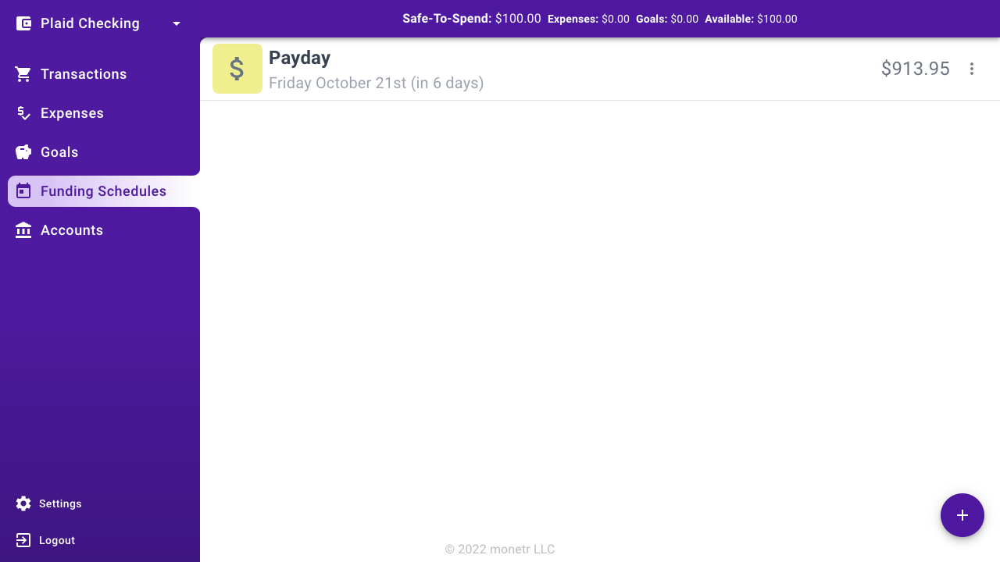

# Funding Schedules

Funding schedules are used to allocate funds to your expenses and goals when you get paid, or at a set interval that is
convenient for you. Every time a funding schedule is processed, all the expenses and goals that are associated with that
funding schedule will receive a contribution towards their target amount.

## Example

If you want to budget every time you are paid, and you get paid every other friday. You can select the next friday you
get paid when creating a funding schedule and select "every other friday" for the frequency. monetr will automatically
keep track of the days you get paid going forward and will split up your budgets to take just a bit out of each paycheck
so you're not covering a large expense all at once.

## The Funding Schedules View

The funding schedules view will show you all of the funding schedules for the currently selected bank account. As 
well as the next day that funding schedule will be processed and contribute to your expenses and goals. It will also 
show you the total dollar amount currently estimated to be contributed at that time.

## Guides

- [Create a funding schedule](./adding.md)

## Development

- [Funding schedule API](../../developing/api/resources/funding_schedules.md)
