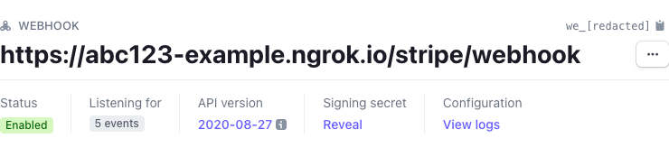

# 3rd Party API credentials for development

To work on all of the features monetr provides locally, you will need access to four sets of API credentials. These
credentials are outlines here in order of significance. monetr or people representing monetr **will not** provide any of
these credentials to you. You are responsible for gaining access to these credentials on your own. None of the
credentials require that you pay for them for development purposes.

## Plaid

Plaid credentials are **required** for local development at this time. Until manual accounts are fully supported, only
live bank accounts can be used for budgeting within monetr. It is recommended to use Sandbox credentials from Plaid for
local development. The "development" credentials (as Plaid designates them) are for live bank accounts, however they can
only be used a limited number of times.

1. Start by creating a Plaid account at: [Plaid Signup](https://dashboard.plaid.com/signup){:target="_blank"}

2. Fill out the form to the best of your abilities. Please do not use `monetr` for the company name.

3. Once you have created your Plaid account, you can find your credentials
   here: [Plaid Keys](https://dashboard.plaid.com/team/keys)

For monetr you will need your `client_id` as well as your `sandbox` secret.

### OAuth

**TODO**

[](https://github.com/monetr/monetr/issues/806){:target="_blank"}

## ngrok

ngrok is used to test code for webhooks. It allows requests to be made to your local development instance from an
external endpoint. You can use ngrok without an API key; however, the tunnels will only last a short amount of time, and
the external endpoint will change each time. This might cause difficulty if you plan on working on webhook related
features. It is recommended to sign up for the free plan of ngrok and use the API key they provide you.

You can sign up for ngrok here: [ngrok Sign Up](https://dashboard.ngrok.com/signup)

## Stripe

If you want to work on billing related features, you can also provide Stripe credentials to the local development
environment. It is required to provide ngrok credentials along-side Stripe for local development. You can sign up for a
Stripe account here: [Stripe Sign Up](https://dashboard.stripe.com/register)

You will need two sets of keys to work with Stripe.

- A **test mode** Stripe secret key. (Not the public key)
- A webhook secret, configured for your ngrok endpoint and with the proper scopes selected.

Once you have made a Stripe account you can follow this guide to retrieve your keys.

### Secret key

Navigate to your [Stripe API Keys](https://dashboard.stripe.com/test/apikeys) page within the dashboard. Make sure you
are in
"Test mode".


You will need to click `Reveal test key` in order to retrieve the API key.


### Webhook secret

On the [Stripe Webhooks](https://dashboard.stripe.com/test/webhooks) page click `+ Add endpoint`.


Enter your ngrok base URL here with the suffix: `/stripe/webhook`

Then you can add events that you need to work with. At a minimum the following events should be added as monetr requires
them.

```text title="Stripe Webhook Events"
checkout.session.completed
customer.deleted
customer.subscription.created
customer.subscription.deleted
customer.subscription.updated
```

Once the webhook endpoint has been created click `Reveal` under Signing Secret to retrieve the secret for the webhook
endpoint.



## ReCAPTCHA

**TODO**

[](https://github.com/monetr/monetr/issues/805){:target="_blank"}
