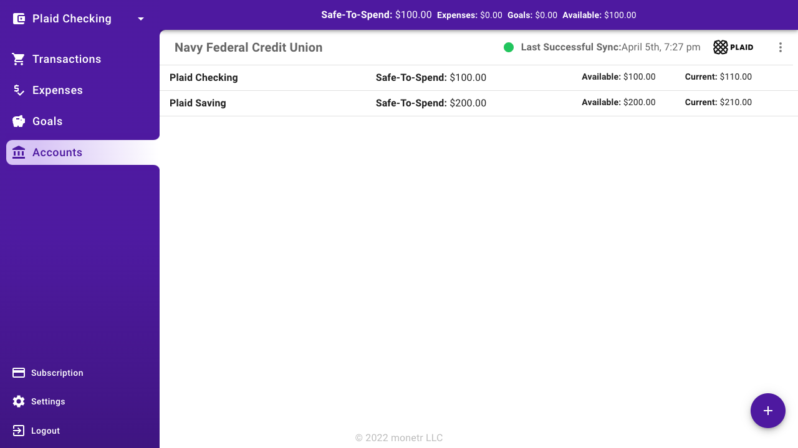

# Removing Bank Accounts

Bank accounts can be removed from monetr by going to the accounts screen via the sidebar.

To remove an account, select the :fontawesome-solid-ellipsis-vertical: icon for the bank. A menu will appear with a few
options.

Simply click `- Remove` to continue.

??? danger

    Removing a bank account that was created by linking with Plaid will remove that link as well. We will no longer be
    able to see information about that account through Plaid. It will also remove all data from our application for that
    bank account shortly after confirming its deletion. This includes any transactions, expenses, or goals created for
    any of the accounts for that bank. **This data cannot be recovered**.

We will ask you to confirm that you want to remove your bank account. This action cannot be undone.

Bank accounts and their information are removed in the background. It will immediately be removed from the UI, but if
you refresh your page shortly after removing it; you may still see it. However, it will disappear shortly thereafter.

