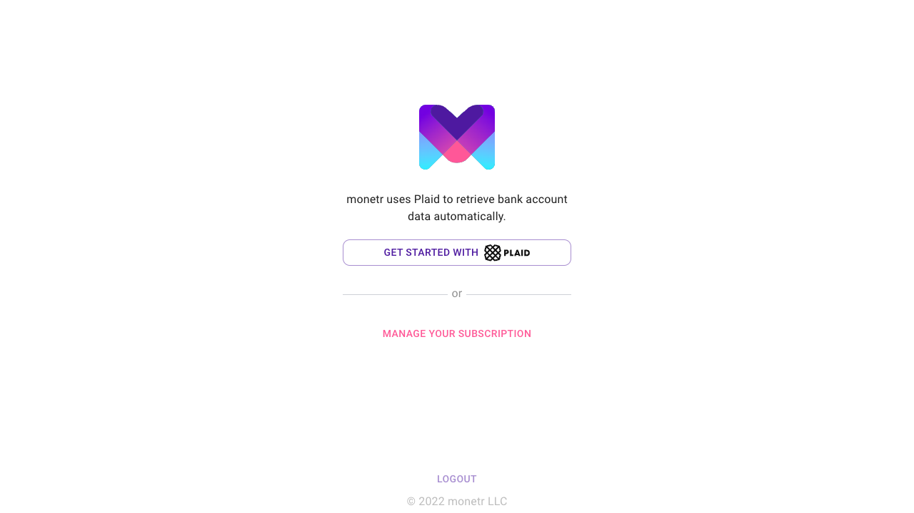
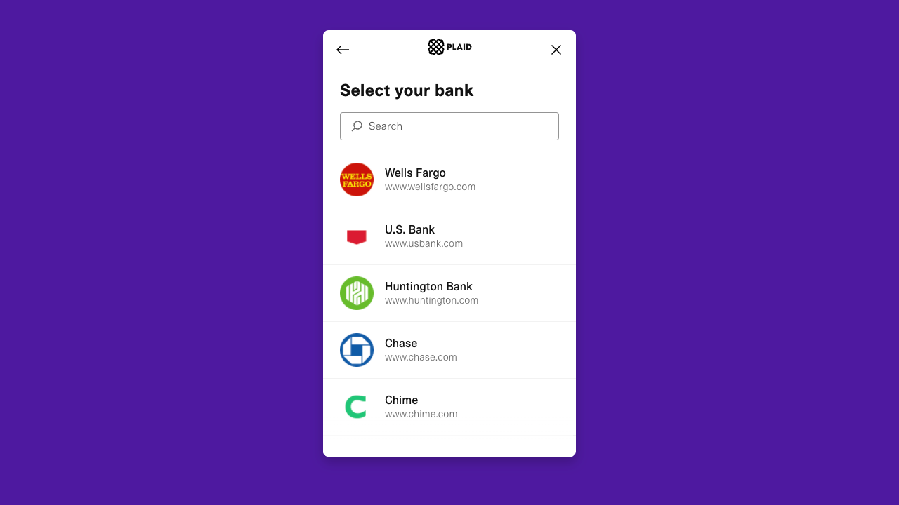

# Getting Started

This article will walk you through signing up for monetr as well as getting the first few things set up.

## Setting up your subscription :fontawesome-solid-cloud: (Hosted)

The hosted version of monetr does require a subscription; to that end we
use [:fontawesome-brands-cc-stripe: Stripe](https://stripe.com) to manage these subscriptions. It allows us to offer our
application to you without needing to store any payment information even partially in our own application. When you
first sign in, you will be redirected to a payment portal inside of Stripe's application. The portal will look similar
to this if it is your first time setting up a subscription.

To continue to the monetr app you will need to provide payment details here. If you want to provide them later you can
use the "back" button in the upper left-hand corner to return to the monetr login screen.

## Your first bank account

Initially you won't have any bank accounts linked with monetr. In the future we do plan to support manual bank accounts
which do not require a Plaid link at all. But at the moment we do require that Plaid is used to connect to a bank
account to retrieve data.

When you first sign up for monetr you will be presented with an initial setup screen. You will be prompted to link a
bank account using [Plaid](https://plaid.com). For the easiest setup, we recommend linking the account that you use
day-to-day. As this account will be the one with the most things to budget for. It's easier to add other accounts later
once you have a good understanding of how the application works.

You can select your bank from the list in Plaid, or search for it using the search box at the top of the dialog. Once
you have selected your bank you will be prompted for your bank account credentials.

??? note

    Plaid supports many banks through their service, and makes it easy for us to safely read basic information in a way 
    that is secure. Our connection to your bank account through Plaid is completely read-only. We cannot access your 
    funds, or any sensitive information about your bank account. We can see your account balance, and the transactions 
    for that account. But nothing else.

Once you have authenticated your bank, you will be given the option to select which accounts monetr will have access to.
It is recommended to select your primary checking account as well as maybe a savings account if you wish to setup some
goals for it.

Plaid will take a moment to perform the link, and you will be returned to monetr. It might take a few moments for monetr
to load, it is pulling transaction data in the background from Plaid. Once it has completed you will be greeted with
this screen.

:tada: You have successfully linked your first bank account with monetr, and you are ready to start planning!
