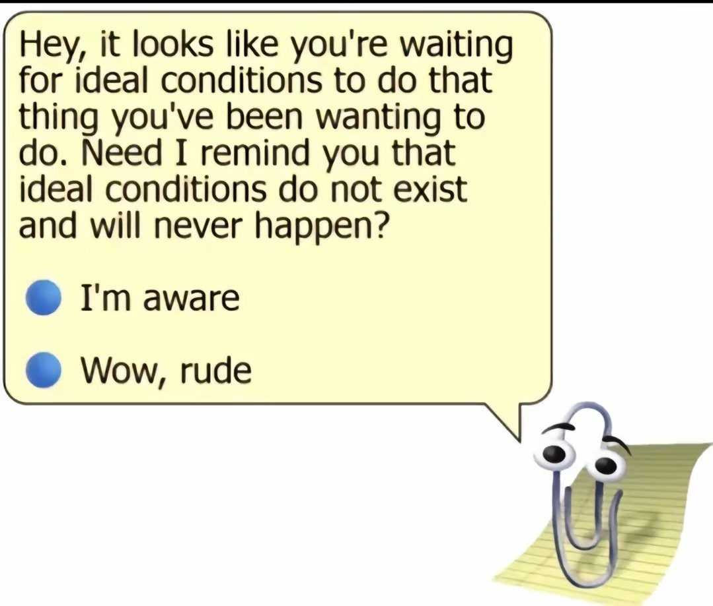
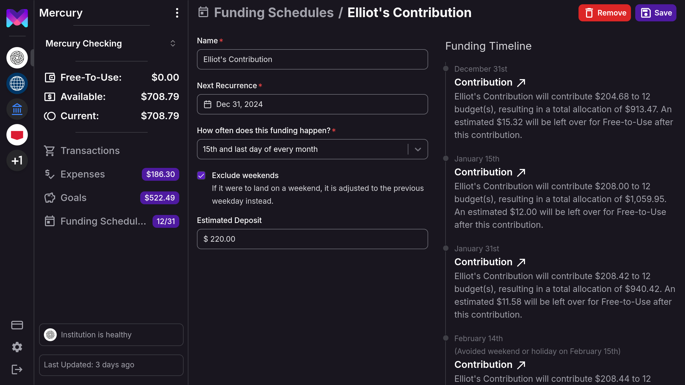
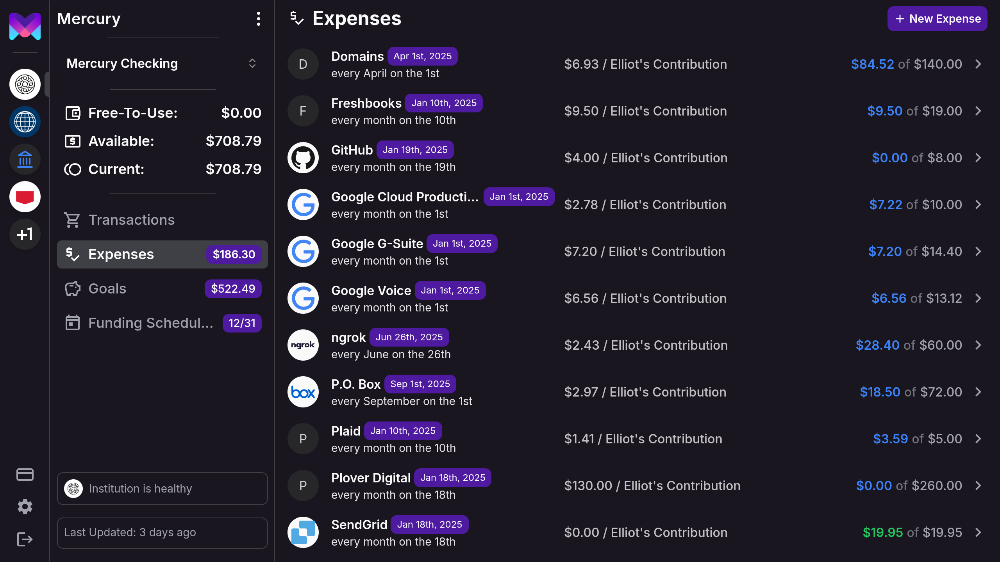
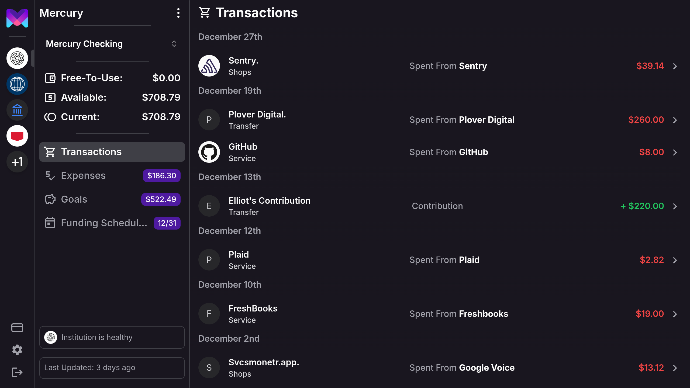
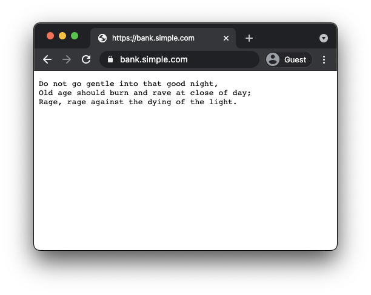

import BlogHeader from '@monetr/docs/components/Blog/BlogHeader';

<BlogHeader />

My name is [Elliot](https://github.com/elliotcourant), and for nearly four years, I've been working on monetr, a
budgeting app inspired by [Simple](https://web.archive.org/web/20201128231953/https://www.simple.com/). I'm excited to
announce that monetr will officially launch to the public on January 3rd, 2025. This blog post is my attempt to
introduce monetr, share why I built it, explain a bit of how it works, and outline my vision for its future. As a
software engineer and not a writer I hope you'll bear with me on my ramblings in this first blog post. I'm excited to
share monetr with you.

# The Problem

I've never really been able to find a good budgeting app. Most budgeting apps I've tried focus on the past—showing you
what you've spent historically, but not what you have right now. They also tend to roll things up into categories like
"automotive" or "groceries". Not easily providing insights into the actual expenses therein.

Take "automotive" for example. It's not just one expense. There's car insurance (monthly or every 6 months), a car
payment (likely monthly), unpredictable costs like gas and repairs, or costs that don't fit on a monthly cadence such as
maintenance. Most budgeting apps lump all of these _different_ expenses into a single category or, at best,
sub-categories. But they're still not addressing the biggest issue: _when_ these expenses happen. A budgeting app that
would ask you to summarize your "automotive" budget for an entire month is just leaving out all of the details of what
is actually happening. How do you budget or plan for something that isn't monthly or isn't even planned?

The better tools I've tried were still rigid about this, maybe they would let me budget more precisely for a specific
expense but would still confine that budget to be month to month. Not even providing an option for expenses that are
more complicated. But even then, they would still make it difficult to see what was left over today. If I needed to add
something to my budget or make an unexpected purchase today, how much could I actually afford?

# monetr's Solution

monetr breaks the problem of budgeting into four different pieces.
- Funding Schedules
- Expenses & Goals
- Spent From
- Free-To-Use

[Funding Schedules](/documentation/use/funding_schedule) are monetr's way of keeping track when you get paid, these can
be far more flexible if you want them to be. But for now let's just think of them as a way of keeping track of when
you're paid. Each time you get paid you want to contribute _some_ amount to your budgeted expenses, but not the entire
amount of the expense. Like if your rent is $1200 a month, but your paycheck is $1500; you never want to take $1200 out
of your paycheck for a single expense.

This is where [Expenses](/documentation/use/expense) and [Goals](/documentation/use/goal) come in. Expenses and Goals
are your way of telling monetr what you need, how much you need, and when you need it by. With the only difference being
that expenses will repeat on a regular basis (but not just monthly, they can repeat weekly, bi-weekly, monthly, yearly
or more). Every time you get paid, monetr takes a portion of that single budget aside and allocates it towards that
budget. monetr automatically calculates how much it needs to put aside each time so that way you will always have enough
to cover that expense when it is due. This even works if you have an expense that happens more frequently than you're
getting paid, monetr will allocate more than a single expense's amount to cover the multiple times you need that expense
between paychecks.

In order to keep track of the spending side of expenses though, you have to tell monetr when you actually use one of
your expenses or goals. For this, every **debit** transaction in monetr allows you to select what the transaction was
"spent from". When you do this monetr will subtract from the selected budget's allocation, instead of from your
free-to-use. This way, planned spending does not affect your free-to-use at all.

Your [Free-To-Use](/documentation/use/free_to_use) is calculated automatically by monetr, and is how much you have left over after all of your budgets
have been accounted for. It is recalculated every time you get paid, and every time you use an expense or a goal. monetr
aims to keep this amount as consistent as possible between your paychecks so that you can easily plan around changing
expenses over time and know what the impact will be.

If you're familiar with Envelope-Budgeting, monetr is very similar. Except contributions to the envelope's are
automated, and a "left-over" or "free-to-use" envelope is used for anything that isn't budgeted. When a transaction
comes through, you just need to tell monetr which "envelope" the transaction was for and it will keep track of the rest.
Most importantly making sure that there will always be enough to cover the transaction when it happens.

# The Future

I have several goals for monetr that I've thought through a ton such that these should not change regardless of how
successful monetr does or does not become. These are the things I want monetr to be or do forever.

## Affordable

It is a budgeting app first and foremost, it should not be expensive. It should be affordable to anyone who might be
struggling to manage their finances. As such monetr is launching with a **$4/month** subscription after a 30-day free
trial.

More than that, monetr will _always_ be free to self-host, and self-hosting will not be treated as an afterthought. It
is my goal to have self-hosted instances of monetr have feature parity with the hosted version of monetr. An example of
this is the **Similar Transactions** feature, which does not leverage the Plaid enrich API or any other third party
system, it works entirely offline. Recurring transaction detection will also be available entirely offline and does not
rely on any third party software or API. (This feature itself is code complete, however it is not yet exposed via the
API).

## Transparent

monetr's [source code](https://github.com/monetr/monetr) is freely available to read, audit and modify. The changes I
make to monetr are free to be scrutinized by anyone and I'm happy to share as many details about the app and how it
works with anyone who is interested.

I would also like to share monetr's financials publicly. This is something I'm still working on in terms of how best to
present them. Should they be a blog post each month? A GitHub repository that automatically pushes updates on a daily or
weekly basis? I'm not sure; but I want to be transparent with how much I spend on monetr and what I spend it on. As well
as what money monetr brings in (if any). But if you're looking for some insights now, all of the screenshots of monetr
in this blog post are for monetr's actual opertating budget as of writing this.

## Ad Free

monetr will never have ads. I personally don't even want to purchase ad space to promote monetr. With the exception of
purchasing directly from an individual or website who respects their end users.

## Respect Privacy

Your information is your own, monetr will never sell your data to anyone. I've worked hard on making a clear and concise
[privacy policy](/policy/privacy) that outlines what monetr does with the data it has. But the code is also fully
available if you want to see for yourself what monetr is doing. But once again monetr is also free to self-host, if you
want to truly keep your data to yourself, you are always welcome to run monetr on your own system.

# Try monetr

If you've gotten this far I cannot thank you enough. If you are interested in monetr please:
- [Sign up](https://my.monetr.app/register) starting January 3rd, 2025. It is free for the first 30 days and no payment
  method is required to try it out.
- Or [install monetr](/documentation/install) on your own system.
- [Star monetr on GitHub](https://github.com/monetr/monetr).
- Share your feedback via [GitHub Discussions](https://github.com/monetr/monetr/discussions) or via
  [Discord](https://discord.gg/68wTCXrhuq).
- Share monetr with anyone who you think might find the application useful.

# Special Thanks

- My wife Leyna, who has been patient and encouraging these past 4 years of late nights and weekends working on
  something I love.
- [Clark Tomlinson](https://github.com/th3fallen) & [Matt Petersen](https://github.com/phanzink) for being a sounding
  board for my ideas over the past 4 years.
- [Sean Sube](https://github.com/ssube), without whom I would have never learned the things I needed to manage monetr's
  hosting and infrastructure myself.
- The entire team who built [Simple](https://web.archive.org/web/20210129214711/https://www.simple.com/), you have no
  idea how much it changed my life. 
