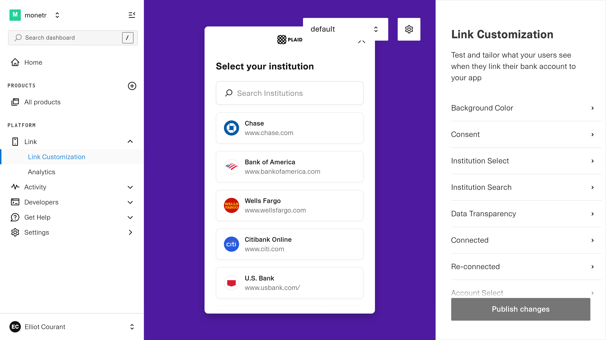
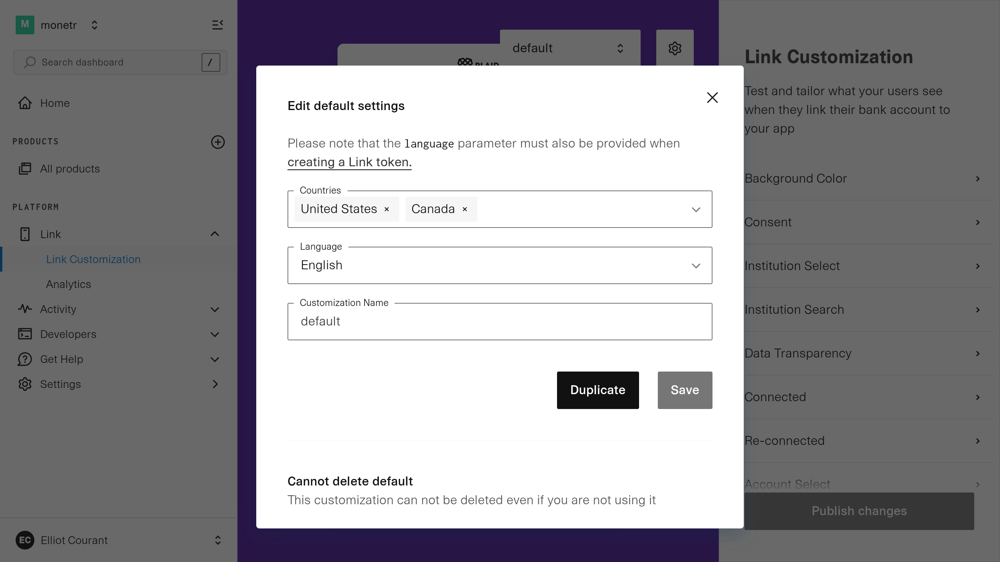

# Plaid Configuration

This guide shows you how to configure Plaid for your self hosted monetr instance. This will require Plaid credentials
which can be obtained by following the [Plaid Credentials Guide](../development/credentials#plaid).

```yaml filename="config.yaml"
plaid:
  enabled: <true|false>
  clientId: "..."
  clientSecret: "..."
  environment: "<https://sandbox.plaid.com|https://production.plaid.com>"
  webhooksEnabled: <true|false>
  webhooksDomain: "..."
  oauthDomain: "..."
  countryCodes: ["US", ...]
```

| **Name**          | **Type** | **Default** | **Description**                                                                                                                                                                                                                   |
| ---               | ---      | ---         | ---                                                                                                                                                                                                                               |
| `enabled`         | Boolean  | `true`      | Are users allowed to create Plaid links on this server? Even if this value is `true`, it is only considered enabled if the Client ID and Client Secret are also provided.                                                         |
| `clientId`        | String   |             | Your Plaid Client ID obtained from your Plaid account.                                                                                                                                                                            |
| `clientSecret`    | String   |             | Your Plaid Client Secret obtained from your Plaid account.                                                                                                                                                                        |
| `environment`     | String   |             | Plaid environment URL, must match the environment of your Plaid credentials.                                                                                                                                                      |
| `webhooksEnabled` | Boolean  |             | If you want to allow Plaid to send updates to monetr via webhooks.                                                                                                                                                                |
| `webhooksDomain`  | String   |             | Required if you want to receive webhooks from Plaid, must be an externally accessible domain name. Plaid also requires HTTPS for all webhooks. Only specify the domain name, not a full URL. Sub-routes are not supported here.   |
| `oauthDomain`     | String   |             | Domain used for OAuth redirect URLs, does not necessarily need to be externally accessible, however must support HTTPS as Plaid will not redirect to a non-HTTPS URL. Only specify the domain name. Sub-routes are not supported. |
| `countryCodes`    | Array    | `["US"]`    | Array of _uppercase_ country codes to enable for Plaid links. See [Non-US Countries](#non-us-countries) for more information.                                                                                                     |

The following environment variables map to the following configuration file fields. Each field is documented below.

| Variable                        | Config File Field       |
|---------------------------------|-------------------------|
| `MONETR_PLAID_CLIENT_ID`        | `plaid.clientId`        |
| `MONETR_PLAID_CLIENT_SECRET`    | `plaid.clientSecret`    |
| `MONETR_PLAID_ENVIRONMENT`      | `plaid.environment`     |
| `MONETR_PLAID_WEBHOOKS_ENABLED` | `plaid.webhooksEnabled` |
| `MONETR_PLAID_WEBHOOKS_DOMAIN`  | `plaid.webhooksDomain`  |
| `MONETR_PLAID_OAUTH_DOMAIN`     | `plaid.oauthDomain`     |

## Non-US Countries

monetr supports connecting to non-US countries via Plaid. However, Plaid has special requirements for connecting to
countries outside the US. For self-hosted environments you will need to contact Plaid support in order to have
additional countries enabled for your account. EU based countries as well as the UK has special requirements and it may
not be possible to connect to them via Plaid given those requirements.

You may also need to customize your link experience inside Plaid to enable additional countries. You can do this on the
[dashboard.plaid.com/link](https://dashboard.plaid.com/link) page.



You can then click on the **Gear** icon in at the top of the page on the right side to see what countries are currently
configured for your link.


