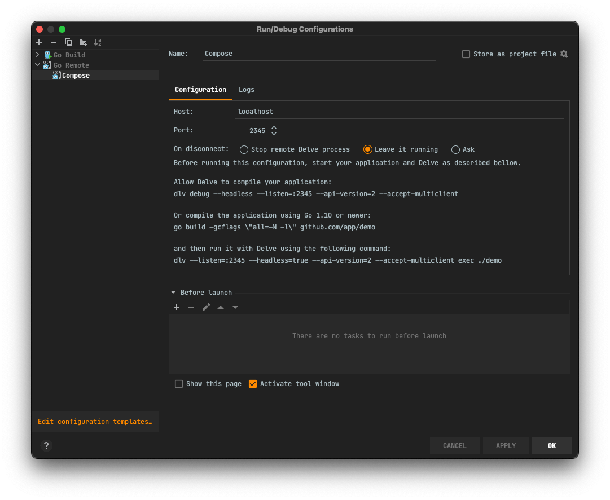

import { Callout } from 'nextra/components'

# Local Development

This guide walks you through setting up a local development environment for monetr on macOS or Linux. If you are using
Windows, it is still possible to run the development environment locally. However, it is not documented at this time.

## Prerequisites

At the time of writing this, monetr requires Plaid credentials for development. Among other credentials, documentation
on how to retrieve them can be found here: [Credentials](credentials.md)

## Clone the repository

To get started, clone the monetr repository from [GitHub](https://github.com/monetr/monetr) or from your fork.

```shell filename="Shell"
git clone https://github.com/monetr/monetr.git
cd monetr
```

The rest of the commands in this guide are issued from this directory.

## Dependencies

monetr does require a few tools to be installed locally in order to develop or build it. These tools are outlined below:

### Required

- Node (`>= 20.0.0`)
- npm (`>= 9.0.0`)
- git (`>= 2.0.0`)
- Go (`>= 1.24.8`)
- CMake (`>= 3.23.0`)
- GNUMake (`>= 4.0`)
- gcc (`>= 12`)

The tools above are the minimum tools required in order to build and work on monetr locally. But if you intend to run
the complete development environment locally or if you plan on creating release builds of monetr you will also need:

### Optional

- Docker (`>= 20.0.0`): Docker (and Docker Compose) are used to run the local development environment for monetr,
  allowing you to have the entire application and all of it's features with hot-reloading.

### Mac Specific

macOS can ship with a version of `make` that is outdated. It is recommended that you use `brew` or any other preferred
method to install the most recent version of **GNUMake** on your Mac. This will not break anything that is already using
make, but will make sure that your version is compatible with the monetr Makefiles.

For example; you should see something like this for your make version.

```shell filename="Shell"
make -v
# GNU Make 4.3
# Built for x86_64-apple-darwin20.1.0
# Copyright (C) 1988-2020 Free Software Foundation, Inc.
```

## Configuration & Credentials

At the moment monetr requires at least Plaid credentials in order to run properly, even for development. You can read
more about obtaining these credentials here: [Credentials](credentials.md)

The makefile will look for these development credentials and some configuration options in the following path:

```shell filename="monetr development env file"
$HOME/.monetr/development.env
```

You can create the file manually like this:

```shell filename="Manually creating the development env file"
mkdir $HOME/.monetr
touch $HOME/.monetr/development.env
vim $HOME/.monetr/development.env
```

Once you've opened this file you'll need to provide the Plaid Client ID as `PLAID_CLIENT_ID` and Plaid Client Secret as
`PLAID_CLIENT_SECRET` here.

Please do not store credentials in the project directory for monetr, it is much easier to accidentally commit secrets to
git when they are in your project directory. Keeping sensitive development credentials outside of the project makes it
much harder to accidentally push them to a public repository.

### CMake

monetr uses CMake as the primary build system, it is also used for running the tasks for local development. If you want
to use a custom CMake configuration you can create a `CMakeUserPresets.json` file in the project directory (it will be
ignored by Git) and populate it with the configuration variables you want to override. If you want to always use a
specific preset when running general make targets you can create a `.cmakepreset` file in the project directory. Inside
that file you can put the name of the preset you want to use by default. Or you can pass `CMAKE_PRESET=...` when running
a make target. 

<Callout type="info">
  `CMAKE_PRESET` is ignored for some make targets, such as `release` and `test`. As each of those targets have a
  specific preset that they are expected to use.
</Callout>

Here is a sample of a user presets file with a few customized options:

```json filename="CMakeUserPresets.json"
{
  "version": 5,
  "cmakeMinimumRequired": {
    "major": 3,
    "minor": 23,
    "patch": 0
  },
  "configurePresets": [
    {
      "name": "developer",
      "displayName": "Developer's custom config",
      "description": "Customized configuration for developer",
      "generator": "Unix Makefiles",
      "binaryDir": "${sourceDir}/build",
      "cacheVariables": {
        "CMAKE_BUILD_TYPE": "Debug",
        "MONETR_LOCAL_DOMAIN": "monetr.local",
        "MONETR_EMAIL_VERIFICATION_ENABLED": "true",
        "MONETR_KMS_PROVIDER": "vault",
        "MONETR_STORAGE_PROVIDER": "s3",
        "MONETR_DEVELOPMENT_LITE_TARGET": "my.monetr.dev",
        "DISABLE_GO_RELOAD": "false"
      }
    }
  ],
  "buildPresets": [
    {
      "name": "developer",
      "configurePreset": "developer"
    }
  ]
}
```

This config specifically changes the following options:

- `MONETR_EMAIL_VERIFICATION_ENABLED`: By setting this to true the developer is required to use the local SMTP server to
  verify their email address when creating a new user. Valid values are `true` or `false`.
- `MONETR_KMS_PROVIDER`: As configured, enables a local instance of [Hashicorp Vault](https://www.vaultproject.io/) as
  well as configures monetr to use Vault Transit for secret encryption and decryption. Valid values are `plaintext`,
  `aws` or `vault`. **Note:** The AWS setting runs a local KMS service compatible with AWS KMS's API.
- `MONETR_STORAGE_PROVIDER`: A minio instance will be run as part of the local development stack. Valid values are `s3`
  or `filesystem`. When using `filesystem` uploaded files will be stored in your `$PWD/build/development/storage`
  folder.
- `MONETR_DEVELOPMENT_LITE_TARGET`: When working on monetr's frontend only, specify an API server that you want to use
  for the frontend to talk to. Requires an account on that API server.

There are other options here that will be documented later, as well as other options that have not been covered here at
all, but those options are the primary ones that change the local development stack the most.

## Starting It Up

With the above requirements installed. You should be able to spin up the local development environment that runs inside
of Docker compose.

This command will also load any of the environment variables specified in the development env file (mentioned above)
into the `monetr` container where the API is running.

```shell filename="Shell"
make develop
```

<Callout type="warning">
  This command may prompt you for an administrator password, this is because monetr is using `mkcert` and `hostess` to
  setup TLS certificates as well as the `monetr.local` domain name in your `/etc/hosts` file.

  Disabling this will be available in the future, but has been required in order to integrate with Plaid's OAuth2 flow.
</Callout>

This will install node modules in the project's directory, as well as start up the containers needed for monetr to run
locally. This command will exit automatically once all the containers are healthy. If you want to follow along while it
is starting up you can use the `make logs` command in another terminal inside the project directory.

### Certificate Problems

If you run an issue where your browser is presenting a message like `net::ERR_CERT_AUTHORITY_INVALID` when trying to
navigate to `https://my.monetr.local` then please run the following commands in the monetr project directory.

```shell filename="Shell"
# Removes the current mkcert certificates
sudo ./build/go/bin/mkcert -uninstall
# Reinstall the certificates without root
./build/go/bin/mkcert -install
```

On Linux you may also need to install `libnss3-tools` before running the mkcert install again.

Once you restart your browser completely, this should correct the issue.

## Working

Congratulations, you should now have monetr running locally on your computer. The `develop` task will print out some
basic information for you. But if you missed it, you can access the development version of monetr at
`https://my.monetr.local`.

Almost all of monetr's code is setup to hot-reload as you make changes. The documentation, Go code and React UI will all
automatically reload as changes are made. Changes to the Go code will not invoke a browser refresh of any sort though,
so to observe a new behavior in the API you will need to refresh or make the API call again.

<Callout type="info">
  If you want to disable hot reloading of the Go code, you can include `DISABLE_GO_RELOAD=true` in your env variables
  when you run `make develop`.
</Callout>

### Local Services

As part of the local development stack, several services are run to support monetr. These services include:

- [minio](https://github.com/minio/minio) As an S3 storage backend. The console is accessible via
  `https://s3.monetr.local` when the local environment is running.
- [local-kms](https://github.com/nsmithuk/local-kms) An AWS KMS compatible local development API. This is used for
  encrypting secrets in the local development environment.
- [Mailpit](https://github.com/axllent/mailpit) An SMTP server that allows emails to be sent without really sending
  them. This is used to validate and test communication functionality locally. This service is accessible via
  `https://mail.monetr.local` when the local environment is running.
- [Vault](https://www.vaultproject.io/) Vault secret management and encryption, Transit is used by monetr for storing
  secrets securely. Available at `https://vault.monetr.local` if you have Vault enabled in your user preset.

### Debugging

The monetr container running the API has [delve](https://github.com/go-delve/delve) included. If you prefer to work
using a step-debugger you can connect your editor to it. You will need to reconnect your editor each time it reloads,
but it is very easy to make your changes and then hit _debug_ and let your breakpoints be hit.

Delve is available via port `2345` on `localhost`. I'm not sure what the configuration will be for every editor to
connect to it; but this is a screenshot of IntellJ IDEA's configuration for remote debugging.



### Tests

monetr requires a PostgreSQL instance to be available for Go tests to be run. At the moment there isn't a shorthand
script to provision this instance. But an easy way to do so is this:

```shell filename="Shell"
docker run -e POSTGRES_HOST_AUTH_METHOD=trust --name postgres --rm -d -p 5432:5432 postgres:16
```

This will start a PostgreSQL instance in Docker (or remove an existing one) and make it available on `locahost:5432` as
well as not require authentication. This makes it easy for tests to target it.

If tests are run via `make` then nothing more needs to be done. However, if you want to run tests directly from your
editor or other tools you will need to run the database migrations.

```shell filename="Shell"
make migrate
```

Will run all schema migrations on the PostgreSQL database on your localhost container.

---

Tests can be run using the `go test` CLI, or all tests can be run using:

```shell filename="Shell"
make test
```

If needed, you can also specify a concurrency or a pattern of tests that should be run using a combination of the
following Make arguments.

```shell filename="Shell"
make test CONCURRENCY=16 PATTERN=interface
```

`PATTERN` will restrict tests to the pattern specified based on the name of the test. Where as `CONCURRENCY` will limit
the maximum number of tests to run at the same time. **Note**: Interface/UI tests do not necessarily run at the max
concurrency as those tests will consume more than a single CPU core.

### Storybook

monetr now provides a storybook setup for working on UI components outside of running the entire application locally. To
start storybook you can run the following command.

```shell filename="Shell"
make develop-storybook
```

This will kick off the storybook development server. You can make modifications to the stories locally or components
used in stories and see the changes reflected with hot-reloading.

To build the storybook as a static set of assets, you can run the following command:

```shell filename="Shell"
make storybook
```

This will output the storybook assets in `$PWD/build/stories/dist`

### Frontend

An alternative to running storybook to work on only the frontend components of monetr is to run a "lite" development
environment. The lite environment only runs the frontend dev server and instead of requiring an active API server and
additional services to be running locally, you can instead point the frontend at a desired API server.

To start the "lite" development environment run the following command:

```shell filename="Shell"
make develop-lite
```

This will run the UI dev server locally and the frontend will be available at `http://localhost:3000`. You can now make
any desired changes to monetr's frontend without needing to run all of the services monetr relies on.

This development mode defaults to monetr's staging environment (`my.monetr.dev`), which while it is publicly accessible;
you are not able to create new accounts on it at this time. If you want to change the API server that the lite
development environment is using you can customize the domain name in your `CMakeUserPresets.json` file as noted above
in the [CMake](#cmake) section.

<Callout type="warning">
    Be extremely conscious about what actions you perform in the lite development environment, if you have your
    development environment pointed at the production instance for example; any actions you take locally will affect 
    your real account. Any data modified or deleted will not be recoverable.
</Callout>

### Documentation

monetr's documentation is built using Next.js and Nextra, it can be developed locally using the following command:

```shell filename="Shell"
make develop-docs
```

This will setup everything the documentation site needs and run the Next.JS development server locally, you can now make
changes to the documentation and see those changes reflected in your browser.

**Note:** The "hero" or interface example on the documentation site's homepage _does not work_ in development mode.
    
In order to build the complete documentation site as it is hosted online you can run the follow command:

```shell filename="Shell"
make docs
```

This will compile the documentation and output to `$PWD/docs/out`.

If you want you can then run the entire site using the command: `npx http-server docs/out -c-1`.

### Emails

monetr's email templates are generated using [react-email](https://github.com/resend/react-email). They can be found in
the `emails/` directory in the project folder. These emails are compiled at build-time and include some [go
templating](https://pkg.go.dev/html/template) in their output in order to be useful for the server.

In order to develop or make changes to the email templates and see your changes, you can run the following command:

```shell filename="Shell"
make develop-email
```

This will start the react email development server, allowing you to preview the email templates in your browser with
some preset values (instead of the go template placeholders).

## Cleaning Up

Once you have finished your work and you want to take the local development environment down you have a few options.

### Shutting Down Development Environment

If you want to completely shut everything down then you can run the following command:

<Callout type="warning">
  This will delete all of your local development data, including any Plaid links, expenses, goals, etc...
</Callout>

```shell filename="Shell"
make shutdown
```

This removes the Plaid links that are active, takes down the Docker compose containers, removes their volumes.

### Completely Clean up

If you want to completely start fresh you can run the following make task. This will shut down the local development
environment if it is running, but it will also delete any files created or generated during development. This deletes
your `node_modules` folder, any submodules, and generated UI code.

```shell filename="Shell"
make clean
```

This should leave the project directory in a state similar to when it was initially cloned.

Clean will not remove your `CMakeUserPresets.json` or `.cmakepreset` files.

It is recommended to run `make clean` before performing a `git pull` when working from the main branch, this way changes
in the build system or significant changes to project layout or the application will be applied properly.
