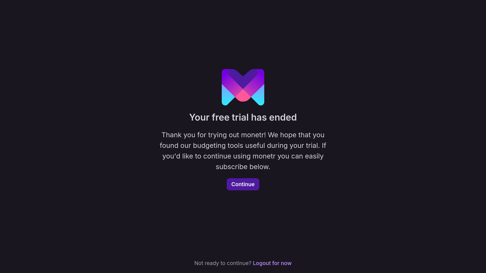

import { CreditCard } from 'lucide-react';

# Subscription & Billing

monetr is a paid product for the hosted version. However, if you'd prefer, you can host monetr yourself for **free**
(see [Self-Hosting](/documentation/install)).

## Trial Period

monetr offers a 30-day free trial to let you explore all its features. During the trial:

- No credit card is required.
- You'll have access to all features, but are limited to a single Plaid connection.
- After 30 days, your trial will expire, and you'll need to subscribe to continue using monetr.

We’ll email you a few days before your trial expires. If you decide not to continue, no action is required.

### What happens when my trial ends?

- You can still log in, but you’ll be prompted to subscribe before using the application.
- After 90 days, any active Plaid connections will be deactivated.



## Subscribe to monetr

When your trial expires, subscribing is simple:

1. Log in to your account.
2. Click the **Continue** button when prompted to subscribe.
3. You’ll be redirected to our billing portal hosted by [Stripe](https://stripe.com) to enter your payment details and
   confirm your subscription.

```
IMAGE PLACEHOLDER
```

## Billing Details

- Subscriptions are billed monthly. See more details on our [Pricing](/pricing) page.
- Billing begins immediately after subscribing.
- You can manage your subscription, update payment methods, or view past invoices by clicking on the
  <CreditCard className="inline" /> icon in the sidebar or selecting **Manage Your Subscription** from the billing page
  under settings.

```
IMAGE PLACEHOLDER
```

## Canceling Your Subscription

You can cancel your subscription at any time:

1. Click the <CreditCard className="inline" /> icon in the sidebar or select **Manage Your Subscription** from the
   billing page under settings.
2. In the Stripe billing portal, click **Cancel subscription**.
3. Confirm your cancellation.

```
IMAGE PLACEHOLDER
```

### What happens when I cancel?

- You'll retain access until the end of your current billing cycle.
- Your data will remain accessible for 90 days after cancellation. During this period, you can resubscribe without
  losing your data.

