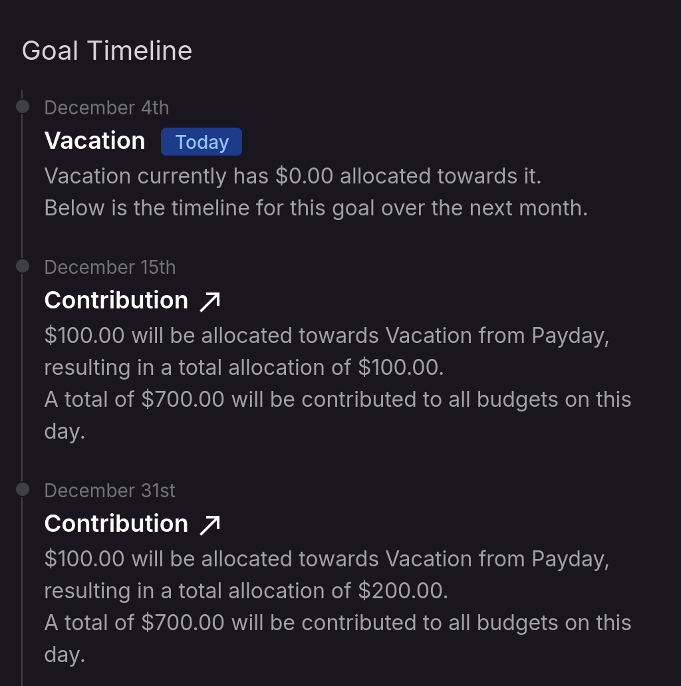

import { Cards } from 'nextra/components';
import { PiggyBank, Banknote, Calendar } from 'lucide-react';

# Forecasting

monetr includes a forecasting feature that it uses to calculate the future of your budgets. This feature can be see on
the [Expenses](./expense), [Goals](./goal), and [Funding Schedule](./funding_schedule) pages.

## Expense Forecasting

Expenses will show you what the current allocation is, and then will show you the next several events. Including
contributions or spending events for that expense.

## Goal Forecasting

Goals are similar to expenses, but will not show a spending event. Since it's not necessarily known to monetr whether or
not you are using the goal throughout the lifetime of the goal (spending from it as you contribute) or if you are
attempting to build up for a singular purchase. Due to this monetr will show you how much will be allocated to the goal
as well as how much is being contributed for the future events of the goal. If the goal is already complete then nothing
will be shown.

## Funding Schedule Forecasting

Funding schedules are forecasted as well, but are summarized differently. The funding schedule timeline will show you
when your next contribution will be made for that specific schedule as well as how much that contribution will be
between all of the budgets using that schedule. If you have specified an **Estimated Deposit** for a funding schedule
then it will also include an estimated **Free-To-Use** amount for that contribution event.

## Related Topics

<Cards.Card
  icon={<Banknote />}
  title="Explore expenses and how they track your recurring spending."
  description="Explore expenses and how they track your recurring spending."
  href="/documentation/use/expense/"
/>

<Cards.Card
  icon={<PiggyBank />}
  title="Learn more about how Goals can be used."
  description="Learn more about how Goals can be used."
  href="/documentation/use/goal/"
/>

<Cards.Card
  icon={<Calendar />}
  title="Setup Funding Schedules to track your income."
  description="Setup Funding Schedules to track your income."
  href="/documentation/use/funding_schedule/"
/>
