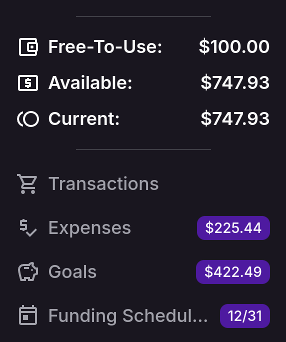
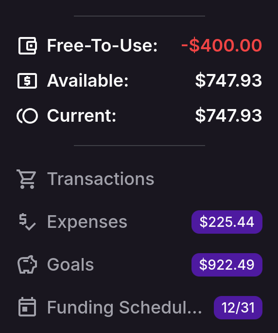

import { Callout } from 'nextra/components'
import { Steps } from 'nextra/components'

# Free-To-Use

## Understanding Free-To-Use

**Free-To-Use** is a powerful feature in monetr designed to help you manage your discretionary spending. It shows you
how much money is available to spend after setting aside funds for your essential budgets, goals, and expenses. By
calculating your Available Balance and subtracting the total funds allocated to your Goals and Expenses, Free-To-Use
ensures that your essential expenses are covered, leaving you with a clear picture of your spending freedom.

  

### How Free-To-Use Works

- **Automatic Updates**: Your Free-To-Use balance is automatically updated whenever there are changes to your budgets or
  account balances. This real-time adjustment means you always have an accurate view of your financial situation without
  manual intervention[^1].

[^1]: This requires that monetr has up-to-date account balances and transactions from your bank.

- **Transaction Adjustments**: If you change a Transaction's "Spent From" field, it can affect your Free-To-Use balance.
  For instance, if a transaction is moved to be spent from a Goal or Expense with allocated funds, your Free-To-Use
  balance may increase.

- **Impact of Expenses and Goals**: 
  - **Expenses**: These are recurring financial obligations like rent or subscriptions. Funds are automatically set
    aside for these expenses, ensuring they don't unexpectedly impact your Free-To-Use balance. If an expense is
    removed, any funds set aside are returned to your Free-To-Use balance, increasing your available spending money.
  - **Goals**: These are savings targets for specific purposes, such as a vacation or a down payment. Allocating funds
    to a goal reduces your Free-To-Use balance, as the money is earmarked for future use. Achieving a goal or adjusting
    its target can free up funds, impacting your Free-To-Use balance.

### Why Free-To-Use is Useful

- **Simplified Budgeting**: For budgeting newcomers, Free-To-Use provides a straightforward way to see how much money is
  safe to spend, reducing the risk of overspending.

- **Financial Flexibility**: Life is unpredictable, and Free-To-Use offers the flexibility to make spontaneous purchases
  or handle unexpected expenses without compromising your financial plans.

- **Informed Spending Decisions**: Knowing your Free-To-Use amount allows you to decide whether to save for a new goal
  or enjoy a night out, all while staying informed about your financial commitments.

## Negative Free-To-Use

Your **Free-To-Use** balance can become negative if the funds allocated to your budgets exceed your available balance.
While this situation should be avoided, it can occasionally happen due to the timing of monetr's automations. For
instance, if monetr processes your funding schedule before your paycheck's transaction or balance is updated in monetr,
your **Free-To-Use** balance might temporarily show as negative until the update occurs.

If this isn't the case, it might indicate that you're stretching your finances too thin. If your budgets require more
than your regular income or if you're spending beyond your Free-To-Use amount, it may be time to consider reducing your
expenses or overall spending.

  

## Transfer (Allocating Funds)

You can easily transfer funds between your **Free-To-Use** balance, Expenses, and Goals. This helps you adjust your
budget as needed. 

<Callout type="warning">
  **Note** 
  This process only changes how funds are allocated within monetr. It does not move actual money in your bank account.
</Callout>

<Steps>

### 1. Navigate to the Expense or Goal you are moving funds between.

First, go to the Expense or Goal you want to adjust. Then, click the **Transfer** button located in the top navigation
bar. This will open the transfer modal.

### 2: Choose Where to Move Funds

In the transfer modal, you'll see two dropdown menus labeled **From** and **To**. Choose where you want to move funds
from and to. You can select any Expense, Goal, or the **Free-To-Use** balance, but make sure the selections are
different. You can also use the arrow button to quickly swap the selections.

For convenience, clicking on any of the amounts displayed above the dropdowns will automatically fill that amount into
the form.

### 3. Finalize the transfer.

Once you've made your selections, click the **Transfer** button to complete the process. The modal will close, and the
allocations in your **Free-To-Use** balance and the selected budget will be updated accordingly.

</Steps>

## The Transfer Modal

The Transfer modal provides quick shortcuts above the dropdowns to help you move specific amounts easily. For the
**Free-To-Use** balance, you can see the total available amount if you want to allocate all of it. For Expenses and
Goals, you'll see three numbers: the current allocation, the target amount, and the difference between them. These
shortcuts make it easy to adjust your budget with just a click.

  

---
