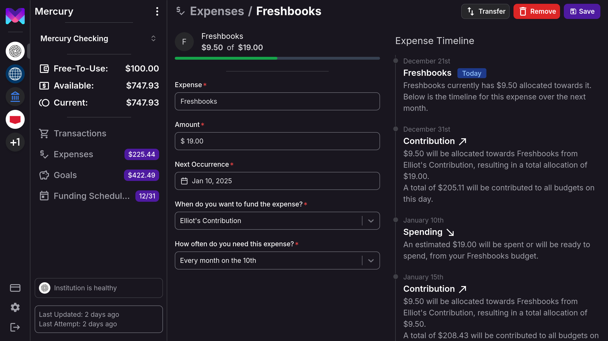
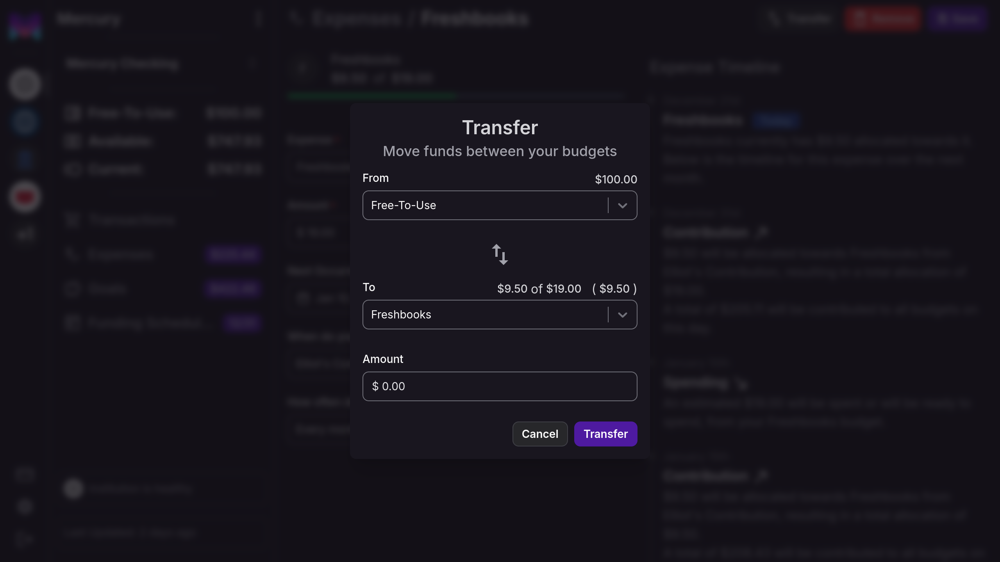
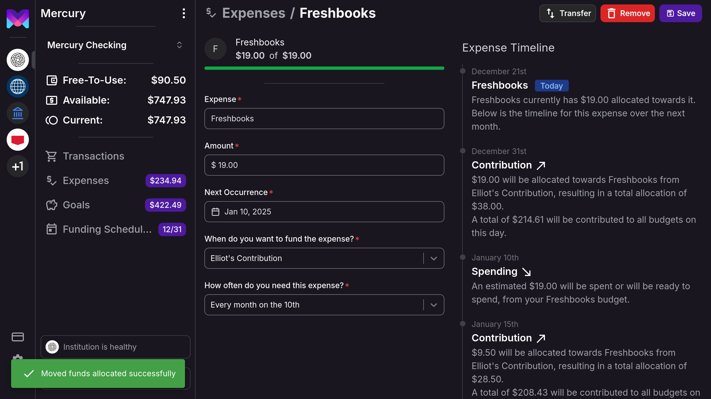
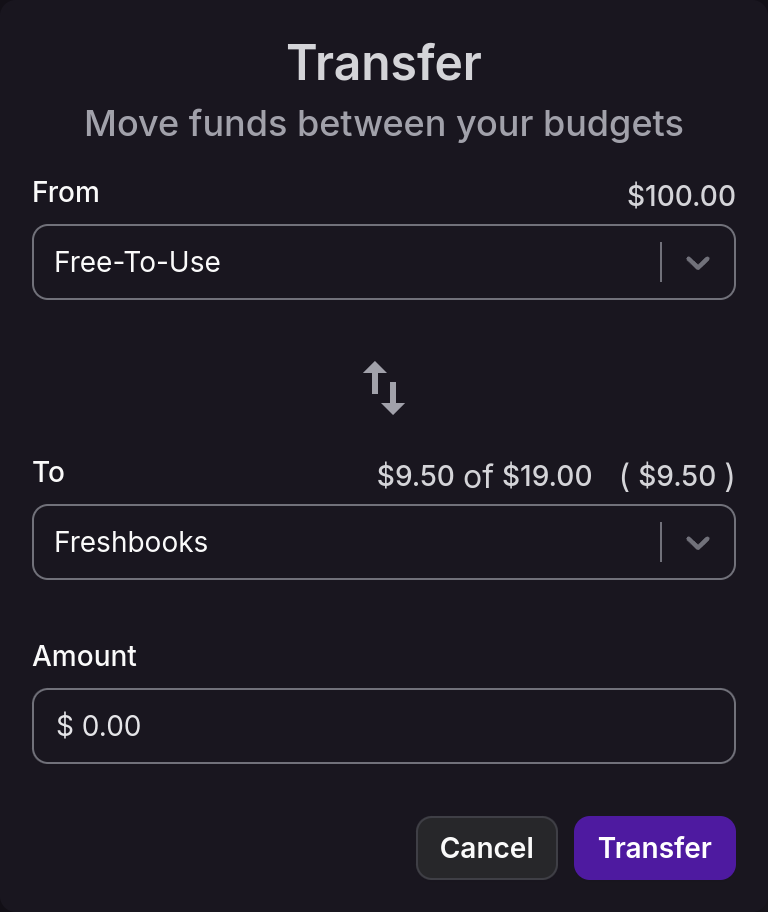

# Free-To-Use

## Understanding Free-To-Use

**Free-To-Use** is a powerful feature in monetr designed to help you manage your discretionary spending. It shows you
how much money is available to spend after setting aside funds for your essential budgets, goals, and expenses. By
calculating your Available Balance and subtracting the total funds allocated to your Goals and Expenses, Free-To-Use
ensures that your essential expenses are covered, leaving you with a clear picture of your spending freedom.

### How Free-To-Use Works

- **Automatic Updates**: Your Free-To-Use balance is automatically updated whenever there are changes to your budgets or
  account balances. This real-time adjustment means you always have an accurate view of your financial situation without
  manual intervention[^1].

[^1]: This requires that monetr has up-to-date account balances and transactions from your bank.

- **Transaction Adjustments**: If you change a Transaction's "Spent From" field, it can affect your Free-To-Use balance.
  For instance, if a transaction is moved to be spent from a Goal or Expense with allocated funds, your Free-To-Use
  balance may increase.

- **Impact of Expenses and Goals**: 
  - **Expenses**: These are recurring financial obligations like rent or subscriptions. Funds are automatically set
    aside for these expenses, ensuring they don't unexpectedly impact your Free-To-Use balance. If an expense is
    removed, any funds set aside are returned to your Free-To-Use balance, increasing your available spending money.
  - **Goals**: These are savings targets for specific purposes, such as a vacation or a down payment. Allocating funds
    to a goal reduces your Free-To-Use balance, as the money is earmarked for future use. Achieving a goal or adjusting
    its target can free up funds, impacting your Free-To-Use balance.

### Why Free-To-Use is Useful

- **Simplified Budgeting**: For budgeting newcomers, Free-To-Use provides a straightforward way to see how much money is
  safe to spend, reducing the risk of overspending.

- **Financial Flexibility**: Life is unpredictable, and Free-To-Use offers the flexibility to make spontaneous purchases
  or handle unexpected expenses without compromising your financial plans.

- **Informed Spending Decisions**: Knowing your Free-To-Use amount allows you to decide whether to save for a new goal
  or enjoy a night out, all while staying informed about your financial commitments.

## Transfer (Allocating Funds)

If you need to you can transfer funds from your **Free-To-Use** to your Expenses or Goals or vice versa. You can also
move funds between Expenses and Goals directly if needed. 

**Note**: This does not move any real funds, transferring is just monetr's way of moving allocations. monetr can never
move actual funds at your bank.

### 1. Navigate to the Expense or Goal you are moving funds between.

Click the **Transfer** button in the top navigation bar.

### 2. Select the source and destination to move funds.

The transfer modal contains two dropdowns. A **From** and a **To**. You can select any expense or goal or the
**Free-To-Use** in these dropdowns, but the selection must be different in each of them. You can use the arrow button in
the middle of the modal to swap the source and destination values as well.

Clicking on any of the amounts above the dropdown will autofill that amount in the form.

### 3. Complete the transfer.

Click **Transfer** to move the funds, the modal will close and the amount allocated to the **Free-To-Use** and the
budget you selected will be updated.

## The Transfer Modal

The Transfer modal has a few amounts above the dropdown of the source and destination. These amounts can be used as
shortcuts to automatically move that amount. The **Free-To-Use** will always have the current amount in the free to use
if you want to move _all_ of it into an expense or a goal. Expenses and goals will have 3 numbers, the first being how
much is currently allocated to the budget, the second is the target amount for the budget, and the third is the
difference between the two.

  

---
