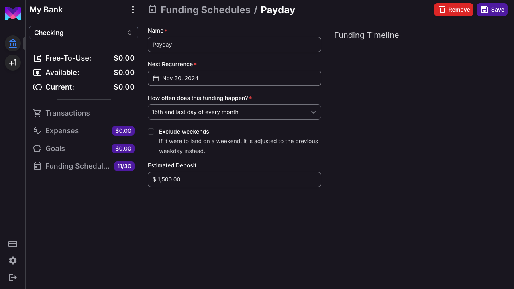
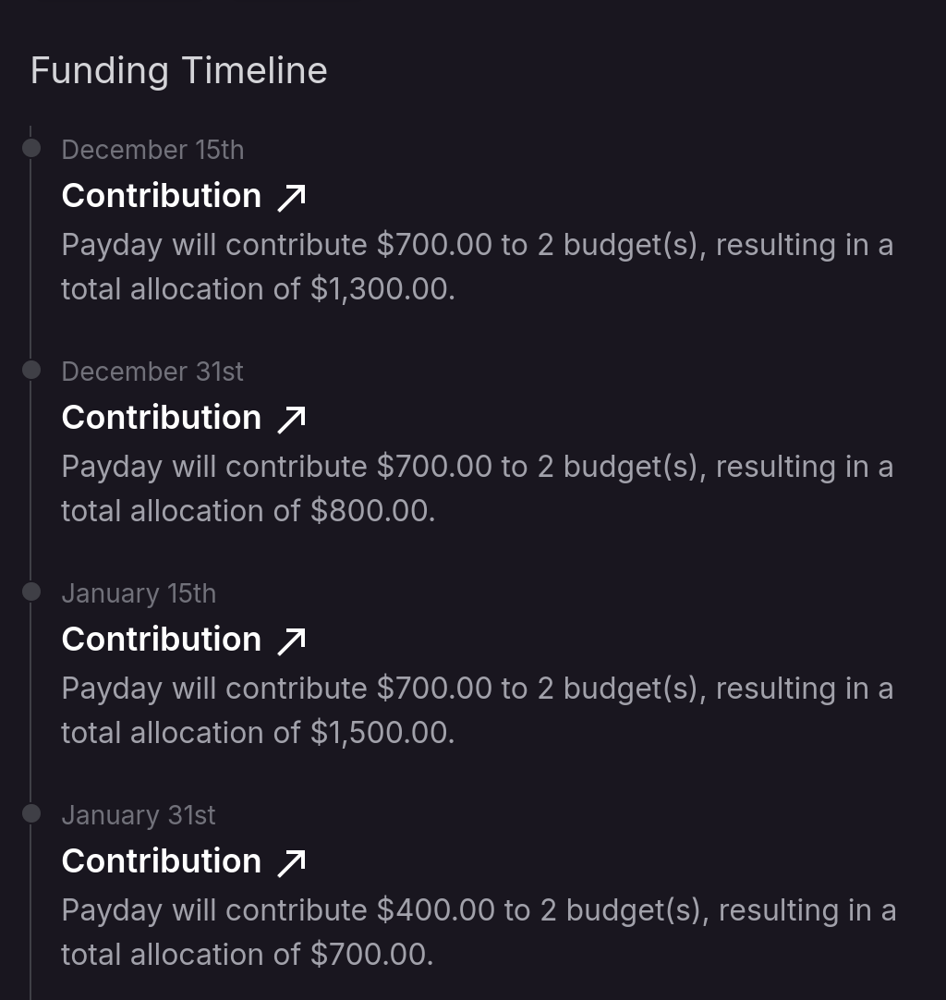

import { Callout } from 'nextra/components'

# Funding Schedules

## What Are Funding Schedules

Funding schedules are how monetr knows when to put funds aside for your budgets. An easy way to think of funding
schedules is "when do you get paid". Allocating funds to your budgets every time you get paid makes sure that you keep
your [Free-To-Use](./free_to_use) predictable and consistent.

You can create multiple funding schedules if you want, like if you want to put money aside for something only once a
month or a little bit every week. Each [Expense](./expense) or [Goal](./goal) you create will always be associated with
a funding schedule though.

Funding schedules are unique per bank account though, not per connection. For example; if you have a checking and a
savings account at the same bank. You may want to create a funding schedule for _each_ of those accounts if you want to
budget within both of them. You can have as many funding schedules per bank account as you would like, but the name of
the funding schedule must be unique within that bank account.

This makes it easier to have one funding schedule in your checking account, for example. With that funding schedule
having the estimated deposit amount for most of your paycheck. Then have a secondary funding schedule for your savings
account with an estimate of how much leftover is deposited there each time you are paid.

## Create A Funding Schedule

To create a funding schedule you can navigate to the funding view of your current account by clicking **Funding
Schedules** in the sidebar.

Then click **New Funding Schedule** in the top navigation to open the create modal.

### When do you get paid next?

This date is used by monetr as a baseline for repeating the funding schedule, it will affect the options presented to
you in the [How often do you get paid?](#how-often-do-you-get-paid) dropdown.

For example; if you get paid every 2 weeks on Friday, you will want to choose the _next_ Friday that you get paid.

### How often do you get paid?

monetr supports a few different recurring patterns for funding schedules. Namely:

- Weekly
- Every other week
- Monthly
- Every other month
- Every third month (quarterly)
- Every six months
- Yearly

If the date you selected in [When do you get paid next?](#when-do-you-get-paid-next) is the 1st, 15th, or last day of
the month; then you will also have the following options available:

- 1st and 15th of every month
- 15th and last day of every month

## Additional Options

Funding schedules have two additional options to provide a better budgeting experience. They can be seen on the details
page of the funding schedule. 

### Excluding Weekends

If you get paid on the 1st and 15th, or 15th and last day of every month; then your paycheck may be available to you
earlier than those exact days each month. This is because deposits are not usually processed on weekends or holidays. If
you want your funding schedule to more closely align with when your paycheck may actually be deposited, then you should
go to the details page for your funding schedule and enable **Exclude Weekends**.

When exclude weekends is enabled, if your funding schedule's _next recurrence_ were to fall on a Saturday or a Sunday;
then the date the funding schedule will be processed is adjusted to be the previous _week day_.

<Callout type="info">
  Holidays are not yet taken into account, but will be in the future. Particularly bank holidays where deposits might be
  affected.
</Callout>

### Estimated Deposit

If you provide an estimated deposit amount for the funding schedule, this will be used in monetr's forecasting tools.
Allowing you to have visibility into how much is being put aside with each of your pay checks ahead of time. As well as
providing insight into how much will be leftover as [Free-To-Use](./free_to_use) the next time you get paid.

### Estimated Contribution

Once you have created [Expenses](./expense) or [Goals](./goal) that use your funding schedule, monetr will provide an
"Estimated Contribution" for your funding schedule on the funding schedule page. This number is the amount of money
monetr expects to contribute to all of your expenses and/or goals on the next date of the funding schedule. It is good
to keep this estimated amount _below_ the amount you will actuall receive each time your funding schedule occurs. If
this number is greater than your expected deposit, then you may not have enough funds to cover all of your expenses.

### Funding Timeline

As you create more [Expenses](./expense) and [Goals](./goal), your funding schedule can provide some high level insights
into what your next funding events will look like.

This timeline will show you roughly how much money it expects you'll need each time you get paid, and if you have
specified an [Estimated Deposit](#estimated-deposit) it will also show you how much it expects will be left over after
your budgets have been accommodated.
