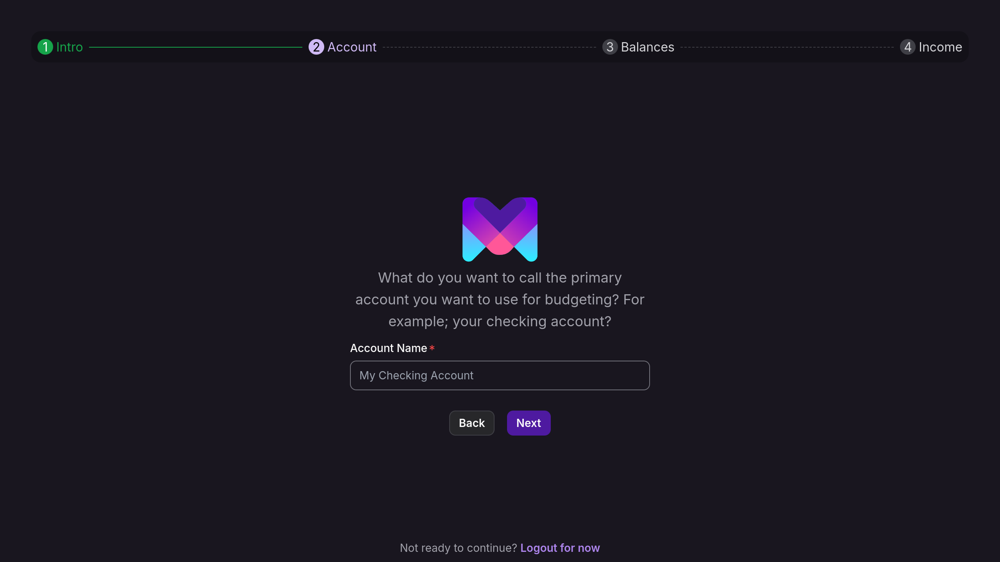
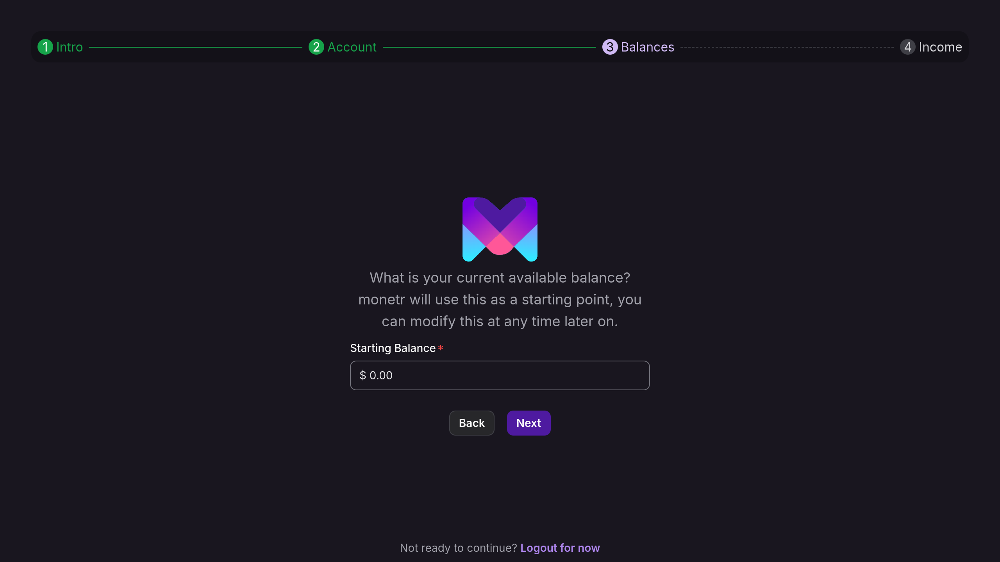
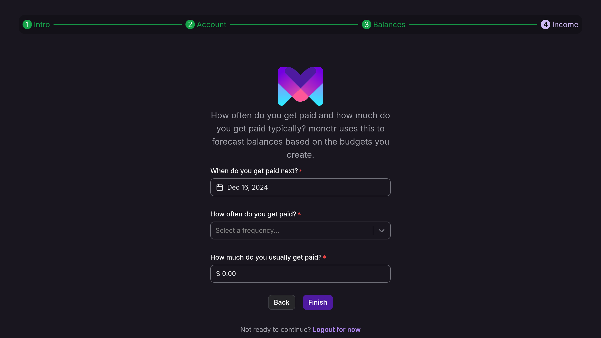
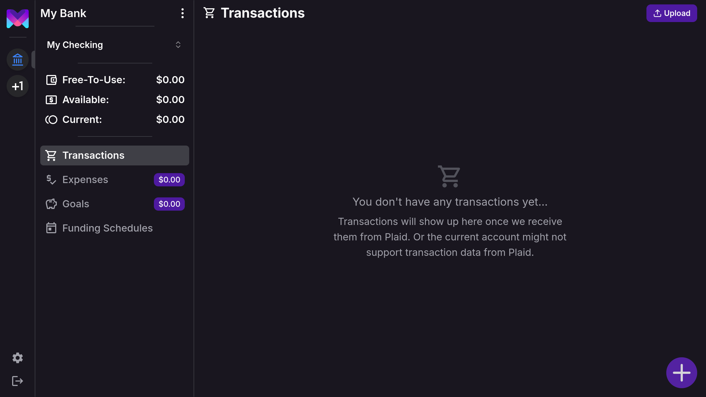

import { Callout } from 'nextra/components'
import { Steps } from 'nextra/components'

# Getting Started

Welcome to **monetr**! This guide will walk you through the initial steps to set up your account and start managing your
finances. You can choose to connect your bank account via our partner [Plaid](https://plaid.com) for automated updates,
or create a manual budget for full control over your data, including the option to upload transactions via a file.

monetr refers to these connections as "links"—a link between monetr and your bank or a "manual link" for self-managed
budgets. The table below highlights the differences between Plaid links and manual links:

| Feature                    | Plaid        | Manual |
|----------------------------|--------------|--------|
| Automated Updates          | Yes          | No     |
| Create Custom Transactions | No           | Yes    |
| Edit Transaction Details   | (Only Names) | Yes    |
| Import Data From File      | No           | Yes    |

<Callout type="info">
    These features may evolve over time as monetr approaches its v1.0 release.
</Callout>

## Link Accounts

Using **Plaid** is the simplest way to manage your finances in monetr. Plaid securely connects to your bank and imports
transaction and balance data automatically.

<Callout type="info">
    monetr uses Plaid to provide **read-only** access to your banking data. This ensures your security—monetr cannot
    move funds in your account. The imported data is exclusively used to create and maintain your budget.

    For more details, review our [Privacy Policy](/policy/privacy).
</Callout>

To get started with Plaid:
1. Select **Plaid** and click **Continue**.
2. Follow the on-screen instructions in the Plaid interface to authenticate your bank accounts.
3. Once complete, you’ll be redirected to the accounts page in monetr to begin creating your budget.

**Tip**: Connect monetr to the bank account you use most frequently for spending. If you use multiple accounts, you can
connect them later.

## Manual Accounts

Prefer to manage your finances manually? monetr provides an easy-to-follow process for setting up a manual budget.

To create a manual budget:
1. Select **Manual** and click **Continue**.
2. Follow the steps below to configure your manual budget.

### Name Your Budget

Give your manual budget a name. This could be the name of your bank or a custom label.

### Create Your First Account

Set up an account within your budget. This account should correspond directly to a real checking or savings account for
clarity and simplicity.

### Set a Starting Balance

(Optional) Enter the current or starting balance for the account.

<Callout type="info">
    If you import data via file upload later, this balance will be overwritten.
</Callout>

### Create an Initial Funding Schedule

To maximize monetr’s functionality, set up a funding schedule for your manual budget. This determines how frequently
funds will be contributed to your budgets. You can modify or delete this later.

### Finishing Up

Click **Finish** to complete your setup. You’ll be redirected to your budget’s page, ready to start managing your
finances!

