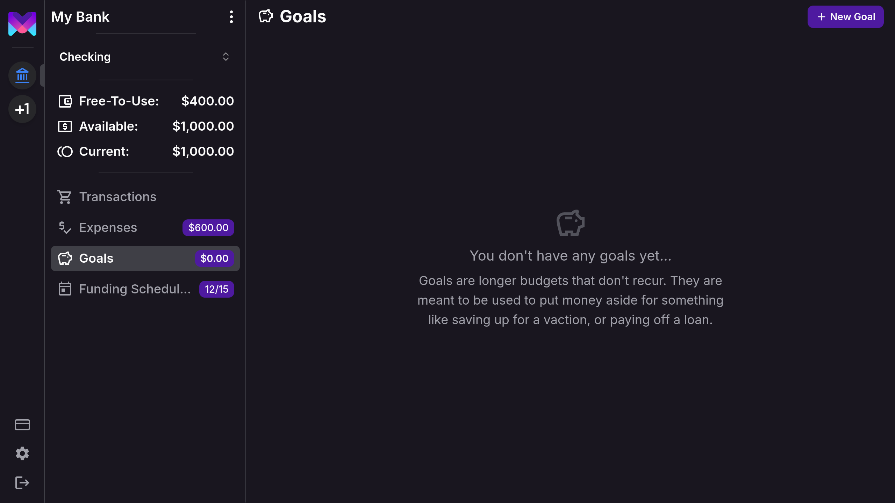
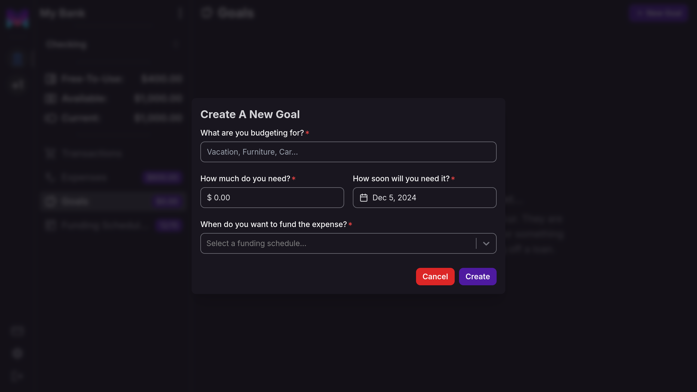
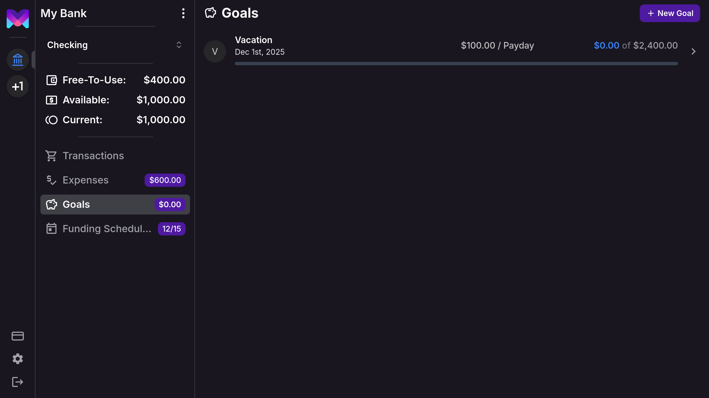
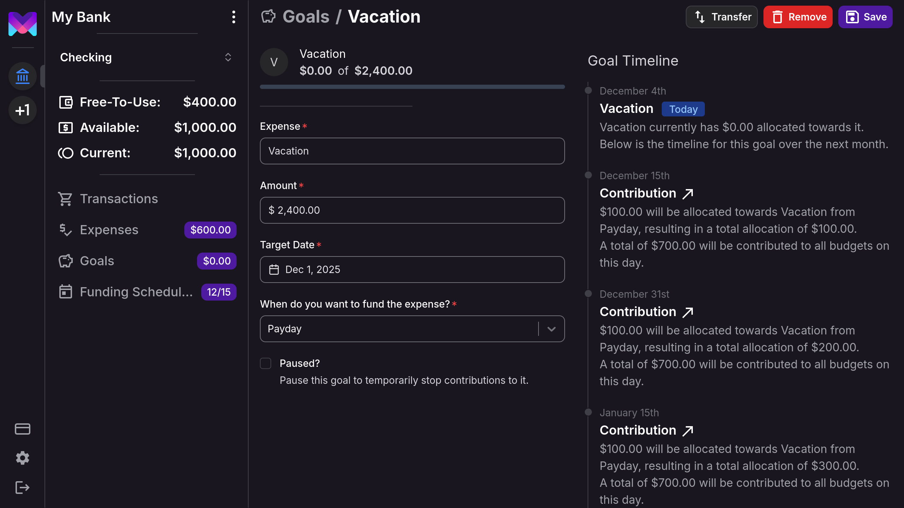

import { Callout } from 'nextra/components'

# Goals

## What Are Goals?

Goals in **monetr** are designed to help you save for one-off financial targets or manage payments toward larger
obligations. Examples include:

- Saving for a down payment on a house.
- Paying off a loan or buy-now-pay-later balance.
- Setting aside money for a vacation or large purchase.

Unlike recurring expenses, goals track both contributions and usage. This ensures you always know how much has been
spent and how much remains allocated, while keeping your contribution schedule consistent.

<Callout type="info">
  **Need to manage recurring payments?**  
  If you're tracking regular expenses like rent, subscriptions, or utility bills, monetr's [Expenses](./expense)
  feature is designed for that purpose. Expenses are ideal for consistent obligations that repeat on a predictable
  schedule.
</Callout>

### Example: How Goals Track Usage

Let’s say you create a goal to save $1,000 by the end of the year. You’ve contributed $100 so far, but you spend $50
from the goal:

- monetr knows $50 has been spent, leaving $50 still allocated.
- Future contributions remain unchanged, as monetr tracks that $900 is still needed to meet the target.

This approach avoids overfunding and ensures contributions align with the goal’s timeline.

## How Goals Differ from Expenses

Although you can spend from both goals and expenses, their behavior differs significantly:

- **Goals**:
  - Track usage versus allocation.
  - Contributions remain consistent because monetr understands how much has already been used.
  - Ideal for saving toward a specific target or managing payments over time.

- **Expenses**:
  - Do not track usage.
  - Contributions dynamically adjust to cover what is assumed to be required (e.g., if funds are spent).
  - Best for recurring obligations where usage tracking isn’t necessary.

This distinction makes goals better suited for long-term planning and flexible spending, while expenses excel at
managing regular, predictable payments.

## Flexible Spending with Goals

A unique feature of goals is the ability to spend from them even before they are fully funded. For example:

- Suppose you set up a $1,000 goal to pay off a loan with monthly payments. You can mark each payment as [Spent
From](./transactions) the goal. monetr will keep track of these transactions and ensure the total contributions still
meet the $1,000 target by the due date.

This makes goals a versatile tool, whether you’re saving for the future or managing payments toward a larger financial
target, while avoiding the risk of overfunding.

## Creating a Goal

To create a goal, navigate to the **Goals** section in the sidebar of your current account.

Then, click **New Goal** in the top navigation to open the creation modal.

### How Much Do You Need?

Enter the total amount you need for the goal. monetr will allocate funds up to this amount by the due date.

### How Soon Will You Need It?

Set a single due date for the goal. monetr uses this to calculate contributions, ensuring the goal is fully funded by
that date.

### When Do You Want to Fund the Goal?

Choose a [Funding Schedule](./funding_schedule) to determine how contributions will be made. If you don’t already have
one, you’ll be prompted to create a schedule during this step.

## How Goals Help

Once your goal is created, monetr automatically calculates contributions based on your funding schedule. Goals provide:

- A way to save for the future with structured contributions.
- A method to track spending for specific purposes, such as loan payments or planned purchases.
- Visibility into progress, showing how much has been contributed and how much is left.

In the goals overview, you’ll see:

- The goal’s due date.
- Its status: paused, active, or complete.
- The amount to be contributed at the next funding event.
- The current amount allocated, available for spending.
- The goal’s total target amount, excluding what has already been spent.

## Goal Details

Click on a goal to view detailed information.

From the details page, you can:

- Modify the goal if your plans change.
- [Transfer](./free_to_use#transfer-allocating-funds) funds to adjust the amount allocated.
- Pause the goal to temporarily stop contributions.

### Pausing and Resuming Goals

When a goal is paused:
- No contributions are made toward it.
- The timeline and calculations are frozen.

When you resume the goal:
- monetr recalculates the remaining contributions to ensure the target is met by the due date.

<Callout type="info">
  If you remove a goal, any funds allocated to it are returned to your [Free-To-Use](./free_to_use) balance.
</Callout>

## Goal Timeline

Every goal includes a timeline that visualizes contributions over time. This timeline:

- Shows planned contributions up to the due date.
- Does not predict spending since goals are designed to be flexible and less structured than expenses.
- If a goal is paused, displays the current amount allocated and today’s date only.

