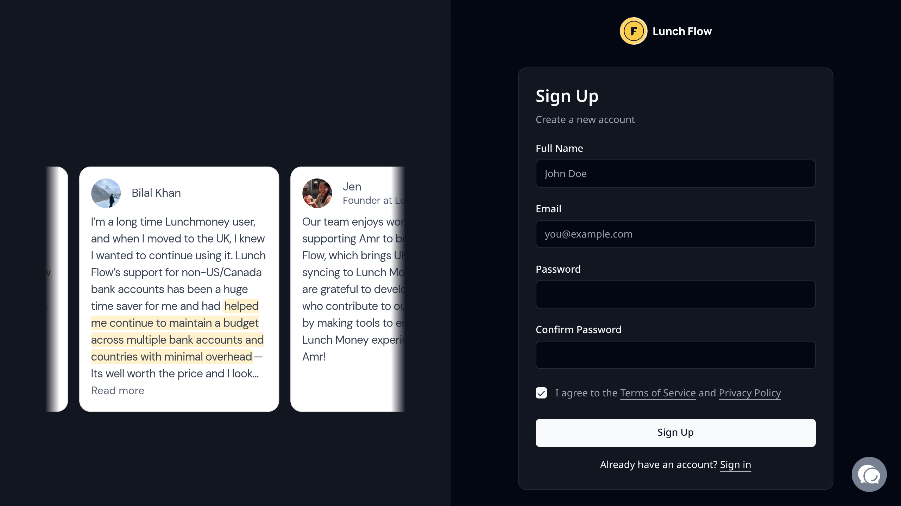
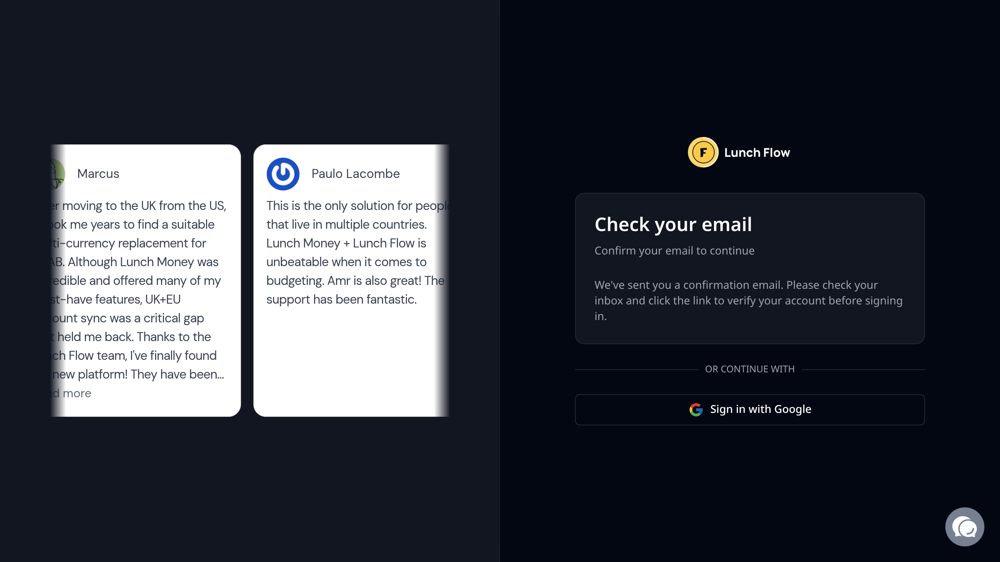
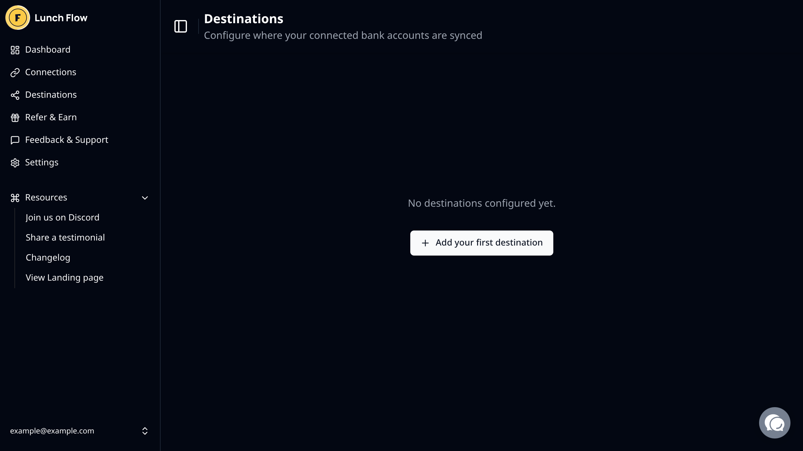
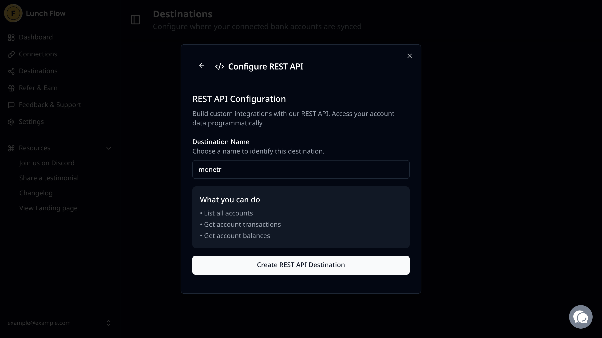
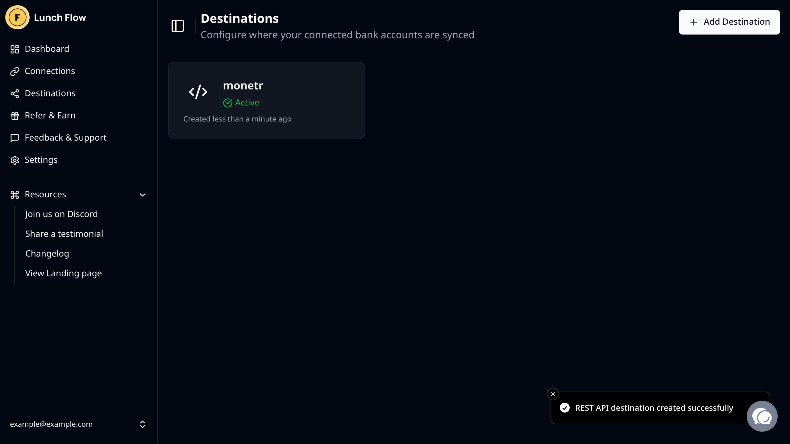
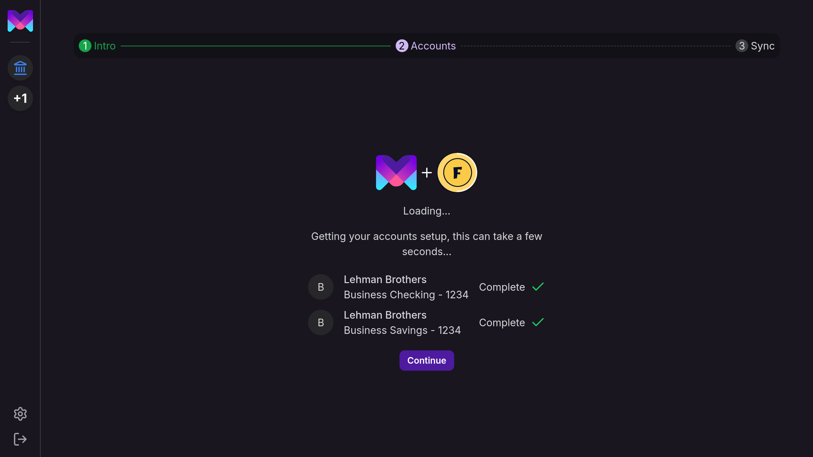
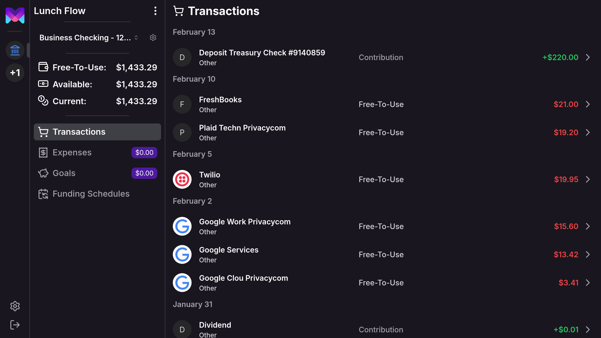

import { Callout } from 'nextra/components'
import { Steps } from 'nextra/components'

# Lunch Flow

<Callout type="warning">
  **Note**
  Lunch Flow is only supported for **self-hosted** instances of monetr, and is not available on the hosted version.
</Callout>

<Callout type="info">
  **Note**
  The Lunch Flow integration is currently considered a **"beta"** integration. There may be bugs and issues with the
  data connection that lead to unexpected or undesired behaviors. Please report any bugs you have to monetr, though
  please understand that some bugs may need to be escalated to the Lunch Flow team if the issue is upstream.
</Callout>

[Lunch Flow](https://www.lunchflow.app/) allows you to connect your self hosted budgeting applications to your bank
directly. This way you can automatically get transaction and balance updates directly in your budgeting app. monetr
supports connecting to Lunch Flow via their API connection.

The benefit of Lunch Flow is that it supports institutions beyond just the United States, instead it supports a wide
array of global institutions all through the same connection. Lunch Flow also supports investment accounts, however
monetr does not support this data just yet.

You can see if your specific institution is supported [here](https://www.lunchflow.app/coverage).

## Setup Instructions

<Steps>

### Sign up for Lunch Flow

Navigate to [https://www.lunchflow.app/signin/signup](https://www.lunchflow.app/signin/signup) and create a new user.

### Verify your Email Address

Once you have signed up you will probably need to verify your email address, do this now in order to proceed.

You'll receive an email from Lunch Flow that looks like this:

Click **Confirm my email** to proceed.

### Start your trial

Before you can setup any connections or destinations you will need to start your trial. Click on the **Start Your
Trial** button at the top of your screen,.

You'll be prompted to select a plan in order to begin your trial:

Select the number of connections you will be adding to Lunch Flow. Keep in mind that a connection is a single login to
an institution and that one connection can include multiple accounts. Select the number you'll need based on distinct
logins, not distinct accounts.

Once you have selected the number of connections, click **Start 7-Day free trial** to proceed.

**Note**: The price or trial length may change in the future, if these docs are not representative of the setup
experience in Lunch Flow then please open an issue in [monetr's GitHub](https://github.com/monetr/monetr).

### Add a connection

After you have started your trial, you'll need to add a connection in order for Lunch Flow to pull data from your
financial institution. Click on the **Go to connections page** button that is now available.

Once you are on the connections page, you can click **New Connection** at the top of the screen to begin the setup with
your institution.

Select the provider based on the region your financial institution is in.

Depending on the provider you select you will be guided through an authentication flow for that provider and your
specific institution.

Once you have completed the connection you should see it on the connections page within Lunch Flow:

### Create the monetr destination

In order for monetr to read the data from Lunch Flow you'll need to add a new API destination that monetr will use. On
the sidebar click **Destinations** to navigate to the destinations page.

Click **Add your first destination** to proceed.

In the Add Destination modal, you'll need to select the **REST API** destination for monetr.

From there you can name the destination whatever you want, but if you are using one destination for monetr only then it
is recommend to name it something meaningful as to not confuse it with other REST API destinations for other tools.

Once you have named it, click **Create REST API Destination** to proceed.

You should now see the destination that you've created.

### Get your API Key

Now that you have an API connection created, click on the connection on that page in order to see it's details.

From here you can **copy** the API Key that you will need for monetr later on.

<Callout type="warning">
  **Note**
  This API Key is sensitive and should be handled carefully. Do not store the API Key in plain text. Store it in a
  password manager or somewhere secure. The API Key is read-only, however it does still allow access to sensitive
  information. Treat it with care.
</Callout>

### Add Lunch Flow to monetr

Lunch Flow should be enabled by default for all self-hosted instances of monetr, but just in case you don't see it as an
option when you go to the setup page you can enable it here: [Configure Lunch
Flow](/documentation/configure/lunch_flow/).

If this is your first link in monetr then you should see the following screen:

Select **Lunch Flow** and click **Continue**.

Name your Lunch Flow connection, this will be the name of the link in the monetr sidebar after you have completed your
setup. Also provide the API Key that you retrieved earlier here, monetr will store this in order to periodically sync
data from Lunch Flow into monetr.

**Optional**: If the API URL you want to use is different than the default one, you can override the API URL that monetr
will use for this connection here.

Click **Next** once you are ready to continue.

### Select accounts to sync

monetr will take a few seconds to pull some basic account information, after which you should see the following screen:

You can now decide which accounts in Lunch Flow should be pulled into monetr on this link. By default all accounts are
enabled. You can disable accounts you do not want to sync with monetr here.

To complete the setup process, click **Continue**.

### Finish setup

monetr will take a few moments to pull in the account data. You can safely navigate away from this page while it is
loading, however it will tell you when it is finished pulling in your data.

You can click **Continue** here to be automatically redirected to one of your new accounts.

### Use monetr

That's it! You now have your institutions data syncing with monetr automatically!

</Steps>

## Syncing

monetr will fetch data from Lunch Flow's API every 12 hours. The exact cron schedule that monetr uses is `30 */12 * * *`. In the future
this will be configurable and will support triggering a sync manually.

monetr will only append transactions, once a transaction has been created in monetr it will not be modified again. At
the moment pending transactions will not be imported at all.

## Nuances

Currently there are a few nuances of the Lunch Flow integration while it is still in beta.

- Pending transactions are not currently synced with monetr.
- All accounts default to a "checking account" once they are imported into monetr.
- Only the "current" balance of the account is available at this time.

### Future Work

- Add support for adding another Lunch Flow account _after_ a connection is already setup.
- Add support for pending transactions.
- Add guides on field mapping in Lunch Flow to improve monetr's data.
- Add a way to manually trigger a sync with Lunch Flow.
- Allow sync frequency to be configured.

## Known Issues

- Similar Transactions is not always working properly with data from Lunch Flow.
