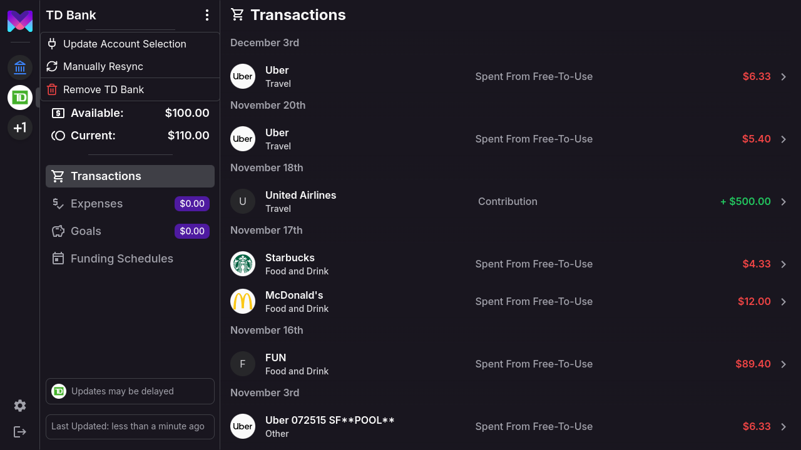
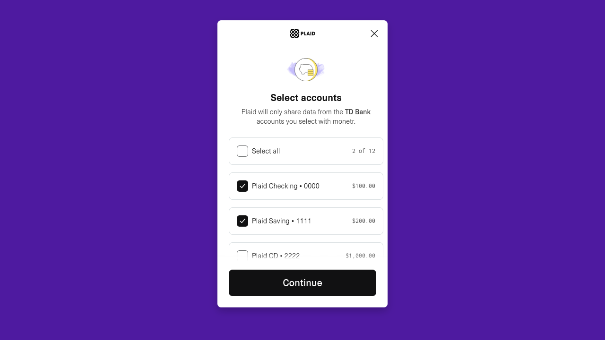
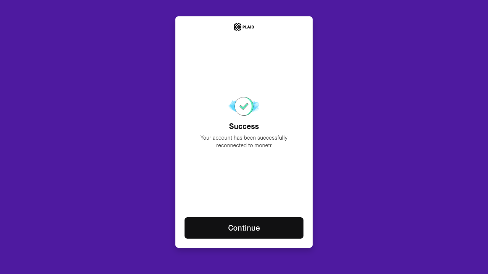
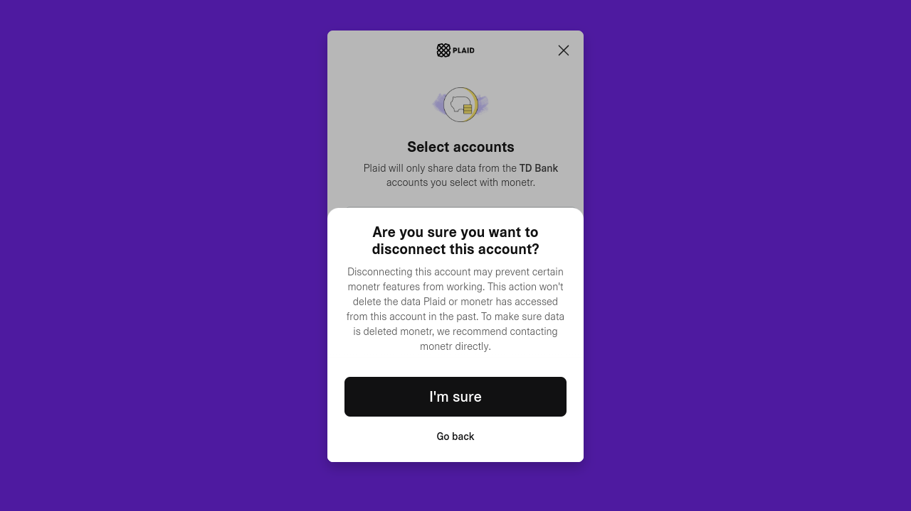
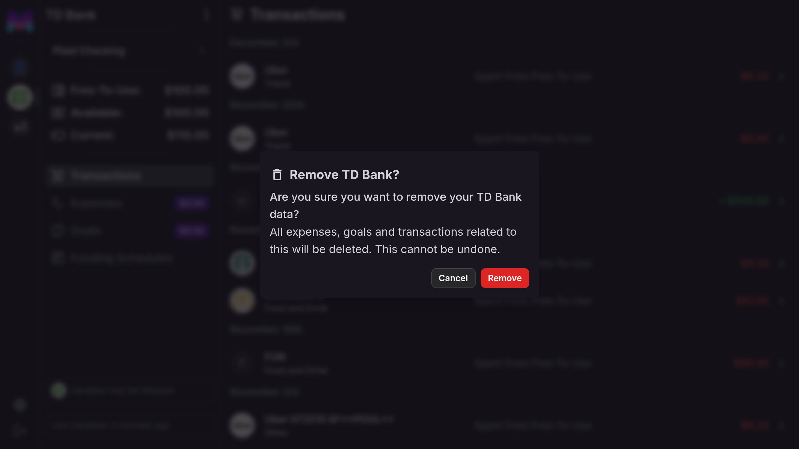

import { Callout } from 'nextra/components'
import { Steps } from 'nextra/components'

# Plaid Integration

monetr integrates with Plaid to connect to your bank accounts, enabling automatic updates for transactions and balances.
This feature simplifies financial management by keeping your data up to date without requiring manual entry. Using Plaid
is optional—monetr can be fully used without it.

## Supported Account Types

monetr currently focuses on **checking accounts** for its features and functionality. While you can connect other
account types (e.g., savings or loans), monetr has not yet implemented features to fully utilize data from these
accounts. Expanding support for additional account types is planned for future updates.

## Institution Health

Plaid connections depend on the reliability of your bank’s integration with Plaid. Occasionally, a bank’s connection may
encounter issues, preventing monetr from receiving regular updates. Here’s how monetr indicates the status of your
institution:

### Healthy Institutions

When Plaid is successfully providing updates, the institution will appear in color in the sidebar:

### Updates Stopped

If updates stop due to an issue with the bank or Plaid, the institution's logo will appear in black and white:

### Re-authenticating Connections

Sometimes updates stop because your connection requires re-authentication. To resolve this:

1. Click on your bank’s name in the sidebar to open the menu.
2. Select **Update Account Selection** and follow the prompts to re-authenticate.

This process may trigger Plaid to sync new data from your institution.

## Adding New Accounts

If you’ve already set up a Plaid connection, you can add additional accounts later. monetr doesn’t automatically detect
new accounts opened at your bank, so you’ll need to follow these steps to add them manually:

<Steps>

### Step 1: Open the Bank Menu
Click the bank’s name at the top of the sidebar. This will open a dropdown menu.

### Step 2: Select **Update Account Selection**
Choose **Update Account Selection** to open the Plaid interface.

### Step 3: Add New Accounts
Select the new accounts you want to connect and click **Continue**.

</Steps>

Once Plaid updates the connection, monetr will sync the new accounts. They should appear in the dropdown under your
bank’s name shortly. If they don’t show up immediately, try refreshing the page.

## Disconnecting a Single Account

To disconnect an individual account without removing the entire link:
1. Follow the steps for **Update Account Selection**.
2. Deselect the account you want to disconnect and complete the process.

The disconnected account may still appear temporarily but will show an **Inactive** badge. It will no longer receive
updates.

## Removing a Plaid Link

If you need to remove a Plaid link entirely:
1. Click on the bank’s name in the sidebar to open the menu.
2. Select **Remove (Bank Name)** and confirm your action.

<Callout type="warning">
  **Important**: Removing a Plaid link permanently deletes all associated data, including transactions, expenses, and
  goals. This data cannot be recovered once deleted.
</Callout>

## Best Practices for Plaid Integration

- **Monitor Institution Health**: Keep an eye on the institution’s status in the sidebar and re-authenticate if needed.
- **Report Issues**: If you encounter recurring problems with a bank, report them to monetr support so we can escalate
  them to Plaid.
- **Regularly Update Connections**: Use the **Update Account Selection** flow to ensure all relevant accounts are
  connected and receiving updates.

## Summary

Plaid simplifies managing your finances in monetr by automating transaction and balance updates. While it’s not
required, it can save time and effort. Use the tools provided to monitor connections, add new accounts, or remove links
when necessary.

