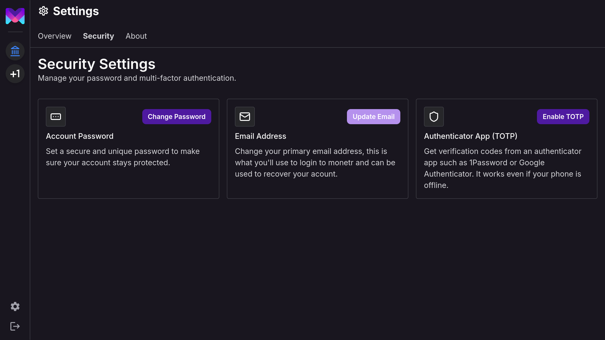
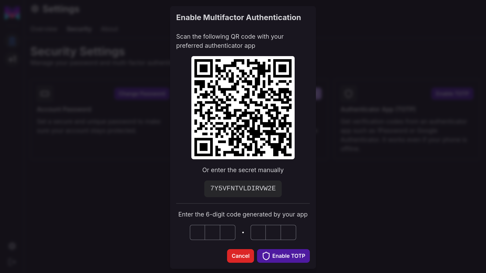
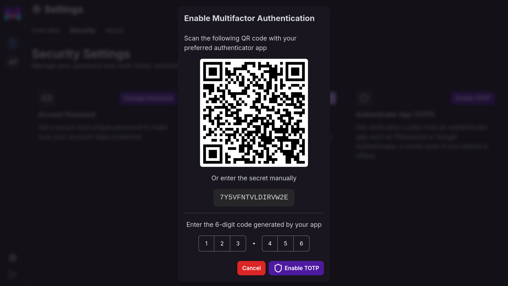
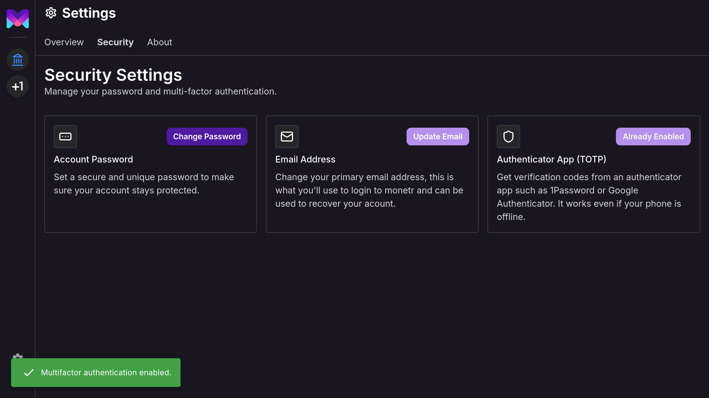
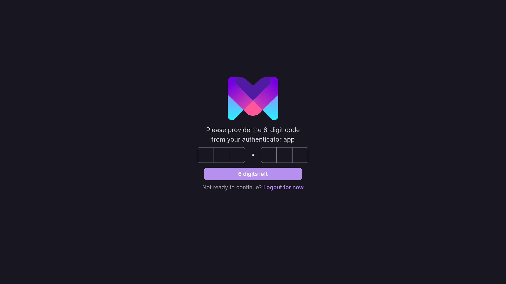

import { Steps } from 'nextra/components'
import { Callout } from 'nextra/components'

# Multi-Factor Authentication

**monetr** supports TOTP (Time-Based One-Time Password) multi-factor authentication, offering a more secure alternative
to SMS or email-based authentication. TOTP requires you to register with a trusted device or service, such as 1Password
or Google Authenticator. Unlike phone numbers or email addresses, which can be more easily compromised, a TOTP-enabled
device or service provides an additional layer of security for your account.

## Setup MFA

You can navigate to the **Settings** page using the **Gear** icon on the sidebar, then clicking **Security** on the top
tabs.

<Steps>
{<h3>Click <b>Enable TOTP</b></h3>}

This will open the multi-factor setup modal.

{<h3>Scan the QR Code or copy the secret</h3>}

Scan the QR Code using your preferred MFA app such as Google Authenticator or 1Password. Or you can copy the secret
generated below into the app manually.

{<h3>Enter the code generated</h3>}

Your app will generate a 6-digit code, enter it in the text field at the bottom of the modal.

{<h3>Click <b>Enable TOTP</b></h3>}

If the code you entered is valid for the secret/QR Code given to you, then this will enable MFA for your account going
forward.

</Steps>

The next time you login to monetr you will be prompted to enter your MFA code from your authenticator app.

<Callout type="warning">
  If you lose access to your authenticator app you will lose access to your monetr account. If this happens please reach
  out to monetr support via [support@monetr.app](mailto:support@monetr.app) and we can help you recover your account
  after verifying ownership.
</Callout>
