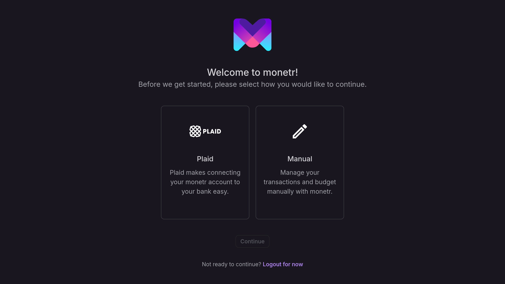
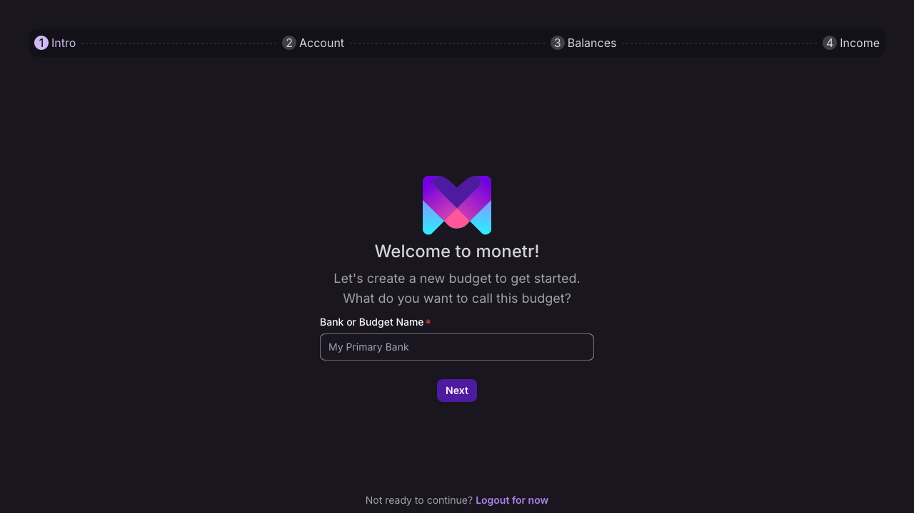
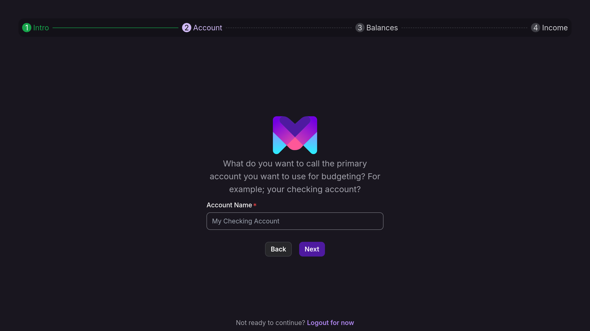
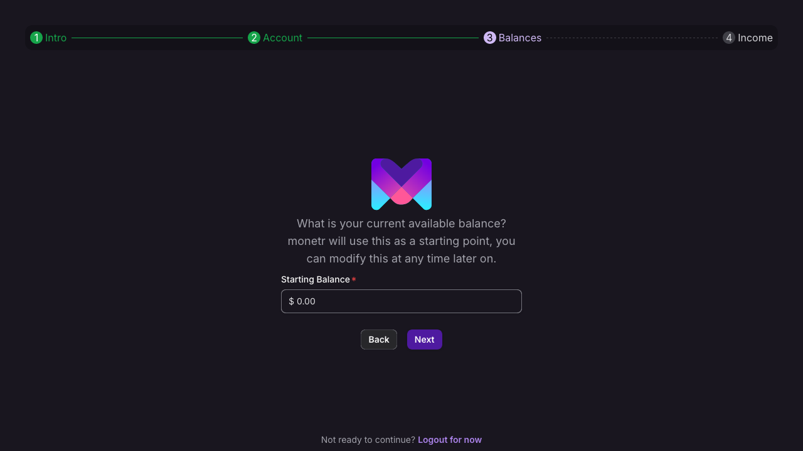
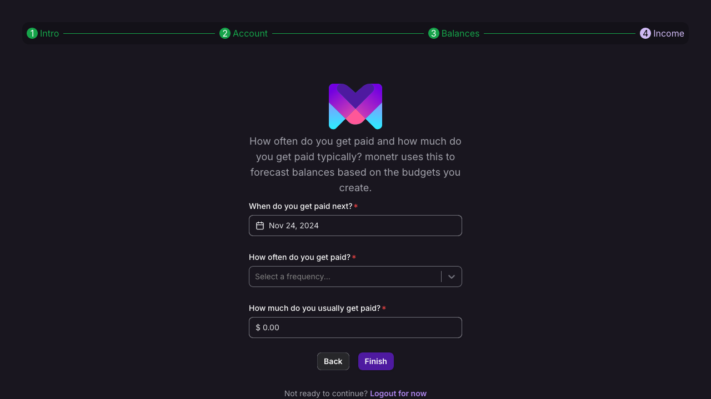
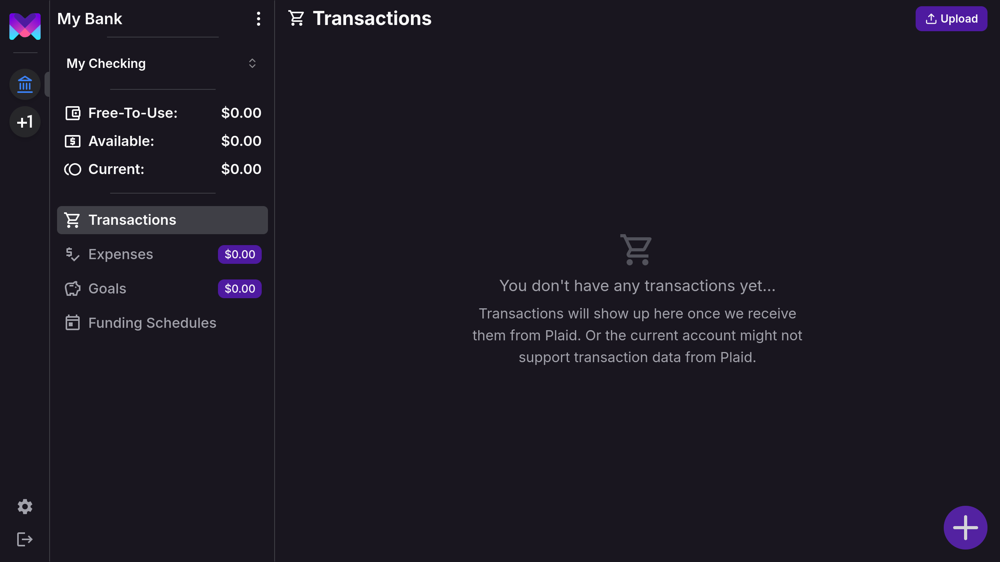

import { Callout } from 'nextra/components'
import { Steps } from 'nextra/components'

# Starting Fresh

This guide helps you with the first steps you'll have to take after creating your monetr login. You'll have the option
to connect your bank account to monetr via our partner [Plaid](https://plaid.com), or you can create a manual budget
that will let you manage your finances directly or via a convienent file upload.

monetr refers to these as "links", as in a link between monetr and your bank or a "manual link/budget". There are some
diferences in how the Plaid links and manual links work once you have them setup.

| Feature                    | Plaid        | Manual |
|----------------------------|--------------|--------|
| Automated Updates          | Yes          | No     |
| Create Custom Transactions | No           | Yes    |
| Edit Transaction Details   | (Only Names) | Yes    |
| Import Data From File      | No           | Yes    |

<Callout type="info">
  These features are subject to change over time, especially as monetr nears its v1.0 release.
</Callout>

## Link Accounts

Plaid can be the easiest way for most people to manage their data, it requires little to no effort to get the
information you need to create your budget into monetr.

<Callout type="info">
  monetr cannot move any funds in your actual bank account via Plaid. monetr receives **read-only** access to data like
  transactions and balances. This data is _exclusively_ used to help you create your budget.

  You can find out more in our [Privacy Policy](/policy/privacy)
</Callout>

Select **Plaid** and click **Continue** to begin the connection process. After a moment you should see the following
screen:

Plaid will guide you through the process of authenticating your accounts. After you have finished you will be redirected
to the account's page in monetr and you can begin creating your budget!

**Note**: It is best to connect monetr to the account you primarily use for spending. monetr does allow multiple
connections if you use multiple bank accounts.

## Manual Accounts

If you would prefer to manage your budget manually, monetr provides a process to setup a manual budget. Select
**Manual** and click **Continue**.

<Steps>

### Name Your Budget

Specify a name for the bank or budget that you are creating.

### Your First Account

Name the account for your budget, this is intended to be 1:1 with an actual checking account in order to keep things
simple.

### Starting Balance

You can specify the starting or current balance for the account if you want. 
**Note**: If you import data via a file upload after this, then the balance will be overwritten.

### Initial Funding Schedule

In order to get the most out of monetr, you'll need to tell monetr how frequently you want to contribute to your
budgets. To get started with this monetr asks that you setup an initial funding schedule for your manual budget. You can
change or delete this later.

### Finishing Up

Click **Finish** to complete your manual budget creation. You'll be redirected to your budget's page afterwards!

</Steps>
