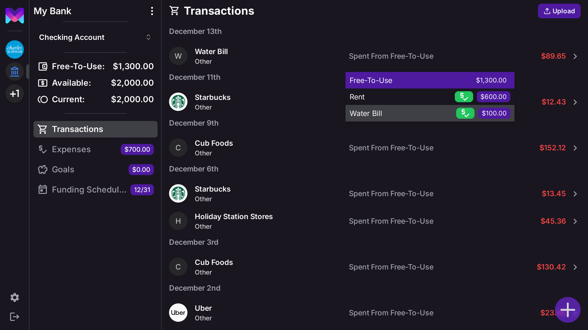
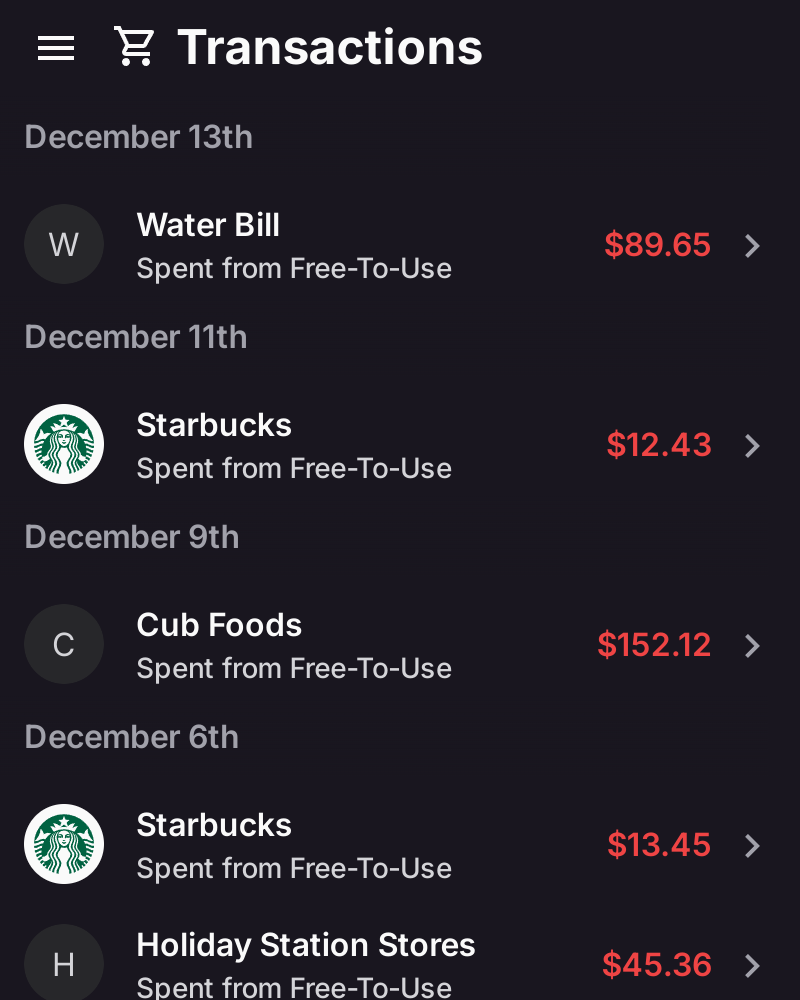
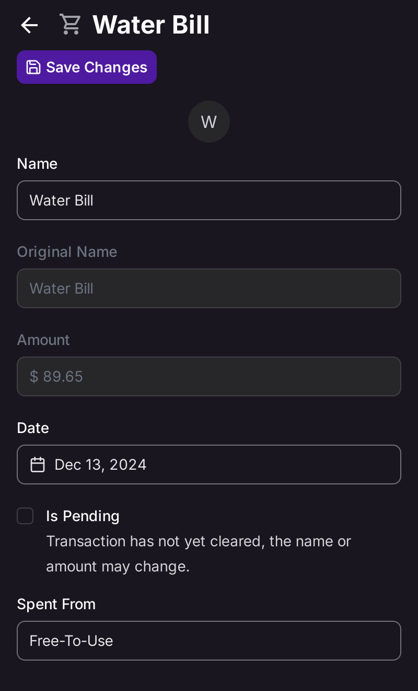
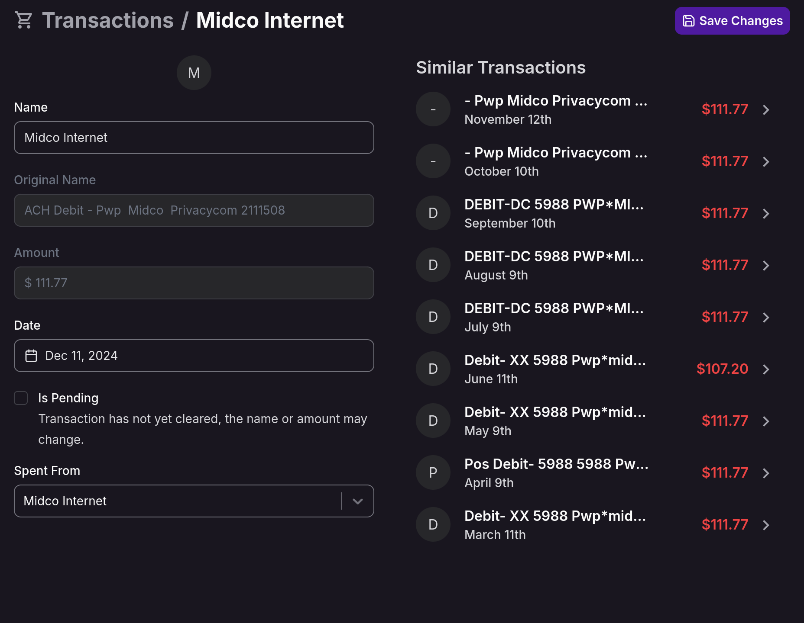

import { Cards } from 'nextra/components';
import { Callout } from 'nextra/components'
import { Steps } from 'nextra/components'
import { HandCoins, PiggyBank, Link2, Upload } from 'lucide-react';

# Transactions

Transactions are the foundation of any budgeting app, and in **monetr**, they are central to how you plan and track your
finances. Unlike some budgeting apps that group transactions into broad categories, monetr maps each transaction
directly to a specific budget, such as Rent or a subscription. This approach makes it easy to:

- See which transactions are part of your planned budget.
- Identify unbudgeted spending at a glance.
- Gain better insight into your financial habits.

## Adding Transactions

You can add transactions to monetr in one of three ways:

1. **[Plaid Integration](./plaid)** (Recommended): Automatically sync transactions from your bank. With Plaid, your
   transactions will appear in monetr automatically, so you can log in periodically and assign them to budgets.
2. **[File Upload](./transactions/uploads)**: Import transactions manually using a file from your bank.
3. **Manual Entry**: Create one-off transactions directly in monetr.

Each method ensures your financial activity is accurately reflected in your budgeting process.

## Assigning a Transaction to a Budget

When a transaction is created in monetr, it is automatically assigned to your **[Free-To-Use](./free_to_use)** budget by
default. The Free-To-Use budget represents the money that is _not_ allocated to specific budgets you've set up.

If a transaction should belong to a specific expense (e.g., Rent) or goal (e.g., Vacation), you can reassign it. Here's
how:

### On Desktop

1. Locate the transaction in the Transactions view.
2. Click on the **Spent From Free-To-Use** text in the transaction row.
3. Select the appropriate budget (Expense or Goal) from the dropdown.

### On Mobile

Reassigning transactions on mobile requires navigating to the transaction details page:

<Steps>

{<h3>Select the Transaction</h3>}

Tap on the transaction in the Transactions view.

    

{<h3>Open the <b>Spent From</b> Dropdown</h3>}

On the transaction details page, tap on the **Spent From** dropdown.

    

{<h3>Choose the Budget</h3>}

Select the budget (Expense or Goal) that the transaction should be assigned to.

    

</Steps>

## Similar Transactions

monetr automatically identifies and groups similar transactions based on their name or memo. This feature is
particularly useful for recurring transactions, making it easier to spot patterns or review related expenses.

- **Supported Methods**: Similar transaction detection works for transactions added via Plaid or file uploads.
- **How to View Similar Transactions**: Navigate to a transaction's details page to see similar transactions listed for
  review.

You can view a similar transaction in detail by clicking the arrow or tapping the item on mobile.

### Notes on Similar Transactions

<Callout type="info">
  **Manually Created Transactions** 
  Similar transaction detection is not currently available for manually created transactions but will be supported in the future.

  **Potential Inaccuracies** 
  This feature is still being refined. The accuracy of similar transactions depends on the quality of the data provided:
  - **Plaid**: Plaid may misidentify merchants, leading to incorrect groupings.
  - **File Uploads**: File uploads typically include raw transaction names, which are easier for monetr to process.
    However, extra details like location can sometimes cause grouping errors (e.g., grouping all transactions from a
    town instead of a specific merchant).

  We’re continually improving this feature to enhance its accuracy.
</Callout>

### Why Transactions Matter in monetr

By managing your transactions effectively, you can:
- Ensure every dollar is accounted for in your budget.
- Easily spot unplanned spending and adjust accordingly.
- Keep track of your progress toward financial goals.

With monetr’s intuitive transaction management, you’re always in control of your finances.

## Next Steps

If you’d like to learn more:

<Cards.Card
  icon={<HandCoins />}
  title="Learn about Expenses to budget for recurring costs."
  description="Learn about Expenses to budget for recurring costs."
  href="/documentation/use/expense"
/>

<Cards.Card
  icon={<PiggyBank />}
  title="Explore Goals to save for one time financial targets."
  description="Explore Goals to save for one time financial targets."
  href="/documentation/use/goal"
/>

<Cards.Card
  icon={<Link2 />}
  title="Set up Plaid for automatic transaction imports."
  description="Set up Plaid for automatic transaction imports."
  href="/documentation/use/plaid"
/>

<Cards.Card
  icon={<Upload />}
  title="Use File Uploads to manually import transactions."
  description="Use File Uploads to manually import transactions."
  href="/documentation/use/transactions/uploads"
/>
