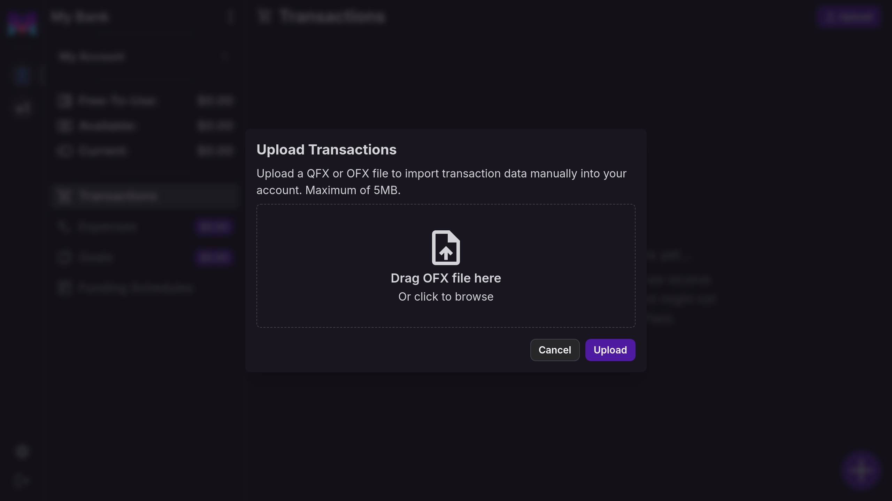
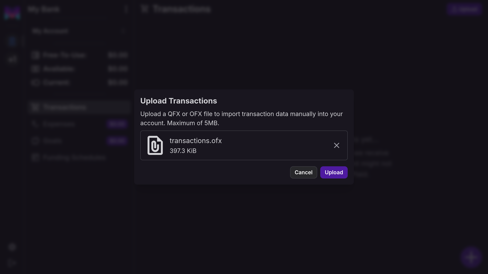
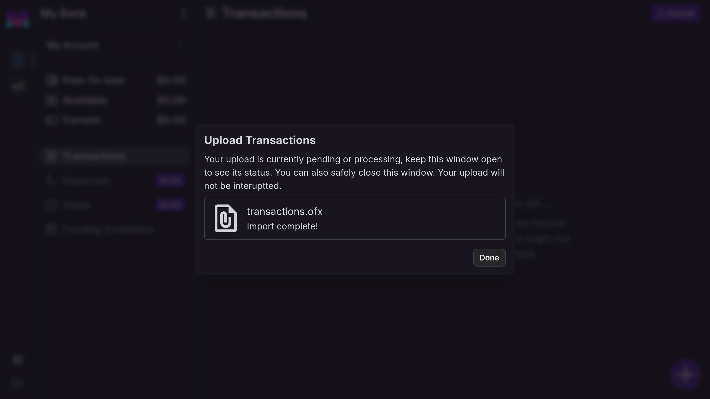
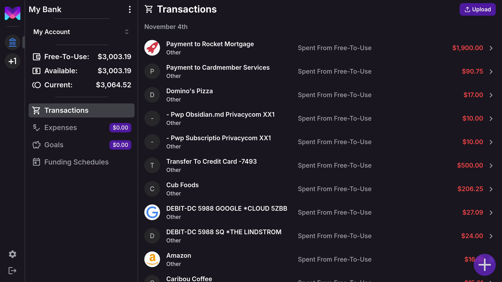

import { Callout } from 'nextra/components'
import { Cards } from 'nextra/components';
import { Steps } from 'nextra/components'
import { ShoppingCart, Link2 } from 'lucide-react';

# Transaction File Uploads

monetr allows you to import transactions and balances via file uploads, providing an alternative for users who prefer
not to use Plaid. This guide explains how to upload files, supported formats, and key considerations to keep your data
accurate and secure.

## Supported File Format: OFX

monetr primarily supports the **OFX (Open Financial Exchange)** file format for importing transactions and balances.
Most US banks offer an option to download OFX files alongside CSV files. OFX files are ideal because they:

- **Follow a Standard Format**: Ensuring compatibility without requiring user modifications.
- **Work Seamlessly with monetr**: Avoiding the complexity of non-standardized formats like CSV.

While **QFX (Quicken Financial Exchange)** files are also accepted, monetr is optimized for OFX files. Some features may
not work as expected with QFX files due to differences in formatting.

## Account Type Support

Currently, monetr supports file uploads for **Checking accounts** only. The structure of OFX files can vary across
account types (e.g., Savings, Credit Card, Money Market), and these are not yet supported. Future updates will expand
support to additional account types.

While imports for other types of accounts may not present an error, the data may be incomplete for those account types.

## How File Uploads Work

When you upload an OFX file to monetr:

1. **Transaction Import**:
   - New transactions from the file are added to your account.
   - Existing transactions are not duplicated or overwritten.

2. **Balance Updates**:
   - The account's current and available balances are updated based on the file data.
   - Accidentally uploading an outdated file will not delete or overwrite existing transactions, but balances will
     reflect the old data. Simply upload the latest file to correct this.

## Important Considerations

<Callout type="warning">
  **Sensitive Information** 
  OFX files may contain sensitive information, such as account numbers. monetr:
  - **Does not process or store sensitive information** like account numbers.
  - **Deletes all uploaded files immediately after processing** to ensure data security.
</Callout>

<Callout type="info">
  **Manually Created Transactions** 
  Currently, monetr does not merge manually created transactions with those imported via file uploads. Manually created
  transactions remain separate.
</Callout>

- **Manual Links Only**: File uploads are supported exclusively for manual links. Plaid-managed links cannot import
  transactions via file uploads.

## Uploading Transactions

<Steps>

{<h3>Click on the <b>Upload</b> button in the navigation bar</h3>}

This will open the file upload modal, allowing you to select your file.

{<h3>Select a file to upload</h3>}

You can click on the file upload area to open a file picker, or you can simply drag a QFX or OFX file into the upload
box to continue.

{<h3>Upload the file</h3>}

Click **Upload** to send the file to monetr for processing, once you do monetr will show the status of the upload to you
in realtime.

{<h3>Complete</h3>}

Clicking on **Done** will close the modal and refresh your view, you should now see the transactions from the file as
well as the balance on the sidebar updated.

</Steps>

## Future Updates

monetr plans to expand file upload functionality to include:
- Additional account types (e.g., Savings, Credit Card).
- Improved integration between manually created transactions and imported transactions.
- Support for additional file formats such as CSV.

## Related Topics

<Cards.Card
  icon={<Link2 />}
  title="Explore automatic transaction syncing with Plaid."
  description="Explore automatic transaction syncing with Plaid."
  href="/documentation/use/plaid"
/>

<Cards.Card
  icon={<ShoppingCart />}
  title="Understand how transactions work in monetr."
  description="Understand how transactions work in monetr."
  href="/documentation/use/transactions"
/>

