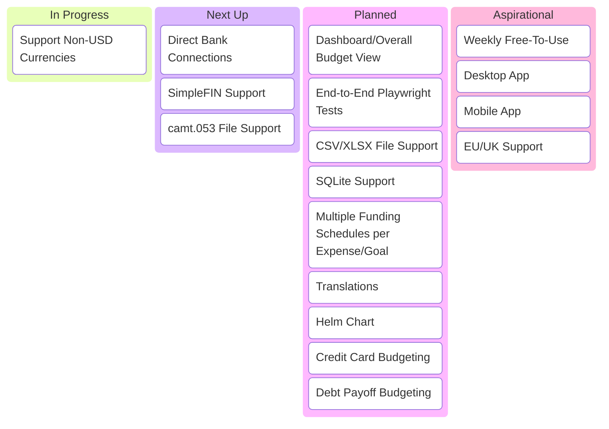

# Roadmap

```mermaid
kanban
  inProgress[In Progress]
    currencies[Support Non-USD Currencies]
  nextUp[Next Up]
    directBank[Direct Bank Connections]
    simpleFin[SimpleFIN Support]
    camt054[camt.053 File Support]
  planned[Planned]
    dashboard[Dashboard/Overall Budget View]
    e2e[End-to-End Playwright Tests]
    csv[CSV/XLSX File Support]
    sqlite[SQLite Support]
    multiFunding[Multiple Funding Schedules per Expense/Goal]
    translations[Translations]
    helm[Helm Chart]
    creditCards[Credit Card Budgeting]
    debt[Debt Payoff Budgeting]
  aspirtaional[Aspirational]
    weeklyFree[Weekly Free-To-Use]
    desktop[Desktop App]
    mobile[Mobile App]
    euuk[EU/UK Support]
```
