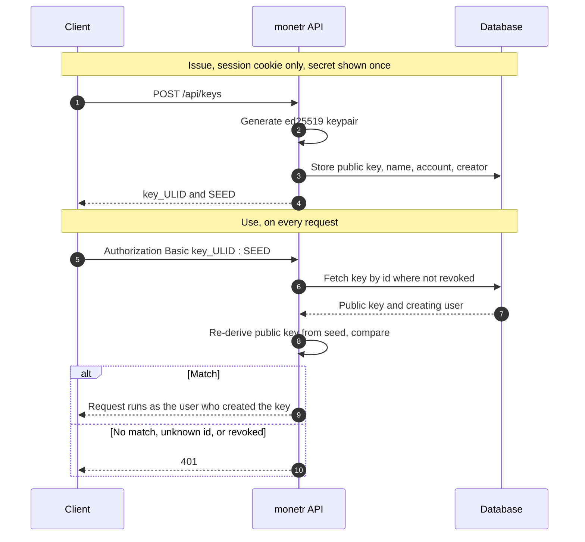

import BlogHeader from '@monetr/docs/components/Blog/BlogHeader';
import BlogMeme from '@monetr/docs/components/Blog/BlogMeme';
import MergeDiagram from '@monetr/docs/components/Blog/MergeDiagram';

<BlogHeader />

<BlogMeme src='/v1/en/blog/2026-09-24-api-credentials/dumbstuff.png' alt='Dumb Stuff'/>

This is just a very informal blog post showcasing (shouting into the void that is the internet) monetr's new API key
authentication which is available now in the [v1.16.0](https://github.com/monetr/monetr/releases/tag/v1.16.0) release.
I'll go over what the credentials can be used for, how they can be generated, and then go into the nerdy details that
will 100% just be me rambling into the void about why and how this took so long.

## What the credentials can do

API credentials can be generated for your entire account and are currently read and write. They provide the same level
of access as the user that generated them has with a few minor exceptions. Endpoints that are intended to be internal
only (such as for subscriptions, changing passwords, etc) are not accessible via API key authentication. However all
endpoints that allow you to interact with your expenses, create transactions, upload OFX files, or maintain your account
balances; are all accessible via the API keys you generate.

## How to generate them

To generate a set of API credentials you can follow the guide [here](/documentation/use/api_keys) to
get started!

With this update I've also published some documentation on monetr's API, with notes on how the endpoints work as well as
designating which endpoints are intended to be internal only and which ones are available for access via the API keys.
You can find that documentation [here](/documentation/api)

## What comes later

This is my first pass at API keys for monetr, it is very unlikely that the credentials themselves will change in the
future; however I am planning on adding more capabilities eventually. Things like read only keys, or permissions for
keys, or bot keys specifically for integrations, and _MAYBE_ OAuth2 based credentials at some point. For the time being
though, this solves one of the biggest asks I've gotten from users which is an easy way to automate access to monetr
without needing to handle how monetr's session tokens expire.

## Nerdy details

A big reason this feature took so long was I spent a lot of time trying to get it right based on how I've interacted
with API credentials in other apps and how I had gotten feedback from people trying to use credentials to automate
things in monetr or show monetr's data in other applications.

### The requirements

- Must be simple, something like basic or bearer authentication
- Must be fast, not CPU or memory intensive since it must run on every request
- Must be secure to store whatever is necessary to validate the credential; preferably not a symmetrically encrypted
  value
- Must be revocable instantly

I've worked on several projects in my career so far that have all done API keys differently than each other, each of
them with various trade offs on how simple it is to implement or how easy it is for a client to use. I wanted to strike
a balance here where I wanted to get the most security out of the keys that I can, without overloading the API key code
with a lot of complexity.

### What I ruled out

A big reason API keys took so long was because I kept second guessing what the right approach would be and trying to
balance that approach against how complex it would be to implement or maintain, or how easy it might be to make mistakes
in implementing it that might compromise the security of the application.

Some of my ideas on how to approach the credentials were:

- [Bcrypt](https://en.wikipedia.org/wiki/Bcrypt) or [Argon2](https://en.wikipedia.org/wiki/Argon2): These were
  attractive because they're both tried and true when it comes to passwords, but their each slow (or can be slow) in
  their own way. They can be demanding on the system running them if they are being executed on every single HTTP
  request a server handles which is ultimately why I didn't go with them. monetr already uses Bcrypt for its password
  authentication though which also made this appealing as it wouldn't be a huge shift in what was already written.
  Though there are some projects that do use these algorithms for API credentials, such as
  [OpenStack](https://github.com/openstack/keystone/blob/c6d3b4ed082f805cd9cfe44b20ef8a9ee7e6ccd9/keystone/application_credential/backends/sql.py#L150-L153)
  or
  [Headscale](https://github.com/juanfont/headscale/blob/c90ba0f0d6f82fe79fc2da82d95561f0e2780628/hscontrol/db/api_key.go#L45).
- [SHA-256](https://en.wikipedia.org/wiki/SHA-2): I explored this one the longest. My first instinct was that a hash
  needs a salt, and some research led me to believe a [Pepper](https://en.wikipedia.org/wiki/Pepper_(cryptography)) was
  better practice still, which is what
  [GitLab](https://github.com/gitlabhq/gitlabhq/blob/05f378c624ce10cf53038271d6595c0d928b49b4/lib/gitlab/crypto_helper.rb#L11-L14)
  does. A pepper is a server side secret though, and self-hosted instances default to plain text for secrets right now,
  so that got complicated fast. What I eventually learned is that salts and peppers protect secrets a person chose,
  because those can be guessed. 32 random bytes cannot be guessed, so a plain SHA-256 is enough. That is what
  [PostHog](https://github.com/PostHog/posthog/blob/master/posthog/models/utils.py) moved to in 2024. This was a
  perfectly good option but my final idea had some benefits on top of what SHA-256 had to offer.
- [PBKDF2](https://en.wikipedia.org/wiki/PBKDF2): This is what
  [Grafana](https://github.com/grafana/grafana/blob/15daf300b68857b7d9cdee12326ed67b6102dc6f/pkg/services/authn/clients/api_key.go#L111)
  and (previously
  [PostHog](https://github.com/PostHog/posthog/blob/ee5545b48507d18bc3de513f128343998cbf74b7/posthog/models/personal_api_key.py#L18-L22))
  do to a degree, but with tens to hundreds of thousands of iterations on the secret. This is secure but is very CPU
  intensive work, especially for validation that must be performed on every single API request. I don't want to
  introduce undue load on my servers hosting monetr or someone hosting it themselves. As well as the design of monetr's
  API lends itself to needing to make a lot of requests to get a complete picture of some data. This is a great option
  if CPU is not a constraint.

### What I settled on

The final option that I settled on is not one that I've seen used in other projects yet, and time will tell if this ends
up being a moment of "making stupid choices in public so people can point them out sooner". monetr uses
[ED25519](https://en.wikipedia.org/wiki/EdDSA#Ed25519) key generation as a one way hash. When you create a credential
monetr generates a keypair, gives you the 32 byte seed as your secret, and stores only the public key. On every request
monetr derives the public key from the seed you sent and compares it to the stored one. Nothing is signed (yet).
Security wise this is the same as storing a SHA-256 of the secret. What it adds is a path forward: monetr already holds
a real public key for every credential, so a future version can let clients sign requests instead of sending the secret,
without anyone rotating their keys.

This has the advantage of the seed of ED25519 being exactly 32 bytes, which is not too small to be easily guessed and
not too large to be an overwhelming or complex secret. The seed of the private key is base32 encoded.
monetr then stores the public key for the keypair in its own database. This way if the stored value is
ever leaked it cannot be used to gain access to the API secret itself.

When monetr receives a request with API credentials, it parses the username as the Key ID and the password as the
secret. It looks up that specific credential in the database and validates the secret provided against the row found (if
one was found). This is done by parsing the secret (converting the base32 string back to bytes)
and calling [`ed25519.NewKeyFromSeed`](https://pkg.go.dev/crypto/ed25519#NewKeyFromSeed) with the parsed value. From
this monetr can then derive the public key and compare the derived public key to the public key stored in the database.
If they match then the request succeeds.



This is less performant than SHA-256, deriving a public key is a lot more work than a single hash. What that cost buys
is consistency, this is the same kind of keypair that monetr already uses for its session cookies, and a path forward
for things like allowing or requiring signed requests in the future. It is still more performant than implementations
such as Argon2, Bcrypt or PBKDF2; without compromising on security (as long as ED25519 remains a trusted algorithm).

All in all, this allows monetr to generate and validate API keys securely, with very little complexity, very quickly. It
also leaves itself open to further optimizations in the future (caching being the biggest one).

## PATCH endpoints

This is one of the other huge reasons that monetr's API credentials took so long in the first place. In general I think
that PATCH requests or the idea of patching in Golang is extremely painful. Getting to the point monetr is in now with
(what I would call) a stable PATCH system; was not trivial and I explored and researched a ton of different methods that
other projects have used. But never have I missed the elegance of
[Clojure](https://clojuredocs.org/clojure.core/merge-with) more than when I was working on how patching in Golang.

### Where monetr was starting from

monetr's initial API was _extremely_ simple and was not user friendly AT ALL. It heavily relied on the `PUT` HTTP method
for updates, and to keep things predictable that required that clients provide the _entire_ object in the PUT request
every single time. This made the validation code for some updates a complete nightmare, and validation code for other
objects complete overkill. It also made client code painful in that if someone wanted to write a simple script to say,
update their bank account balance. That would require that they also pass in the bank account's name, its mask, the bank
account type and sub type, or any other fields that would be added to the API later on. All to update essentially one
field.

The problems that existed in monetr's existing API were:

- No set schema at all, some objects had _okay_ at best validation to prevent super long names or things like that. But
  most endpoints had super bare bones or no validation really.
- Inconsistent patterns between endpoints, some endpoints `name` was allowed to be however long you wanted, others it
  was limited to a set length. Some trimmed white space, others didn't. (Some of this still exists and I'm working on
  improving it, sorry!)
- Errors were all over the place, some endpoints (still) had set error structures and codes for specific events. Others
  just returned various bad request status codes and a generic error string. It wasn't helpful and it would make
  developing against the API painful.
- PUT endpoints where the entire object must be provided, or if fields were omitted then they would be silently changed
  or defaulted was a TERRIBLE pattern.

### What I wanted instead

The problem I wanted to be able to solve for monetr's more "public" API endpoints was twofold:

- I wanted strong schema-esque validation that didn't require that I write a ton of boilerplate code in every single
  controller
    - To that end, I wanted to be able to surface structured errors back to the client when a request failed schema
      validation
- I wanted to be able to "unmarshal" or "parse" a request body and merge it with existing data (or default value data)
  **while**:
    - Distinguishing between a zero value or the absence of a value (and null is exactly the absence of a value in this
      context)
    - Only allowing _writable_ fields to be provided and merged

### What I explored

I write Clojure for my day job, which lends itself nicely to every single problem I had, just in the wrong language. It
has nice tools like [malli](https://github.com/metosin/malli) for schema validation, which can also be used to generate
schema definition files pretty much out of the box. Not having structs helps too, the absence of a field is literally
that; the key does not exist on the map. Golang gets very little out of the box in contrast.

As far as schema validation goes in Golang there isn't really an option that checks every single box I wanted:
- Google's very own [jsonschema-go](https://github.com/google/jsonschema-go) package seemed to be one of the most
  complete JSON schema packages out there, and it let you write the schema in pure go and then export it as JSON which
  would be wonderful. I could have all my schema as code and then export JSON schema files for API documentation. But...
  it's errors are not structured. Instead it would return the first error it encountered in the schema as a simple
  string.
- [Tristan's (Oudwins)](https://github.com/Oudwins) library [zog](https://github.com/Oudwins/zog) inspired by the
  JavaScript library [zod](https://zod.dev/) was another very promising option. It features wonderful schema as code
  helpers, very good documentation, and structured errors out of the box. At the time I was evaluating it the thing I
  ended up getting stuck on was differentiating between a `null` value being provided for a given field, versus that
  field not being specified at all (I'll go into detail on why this is important below). I have a [still open
  PR](https://github.com/Oudwins/zog/pull/219) that I need to come back to that tries to improve on this behavior. But
  also I ended up needing some level of union schemas for a few objects which were difficult to validate without them.
  That ended up stalling the progress I made with that library.

### The schema I ended up with

I ended up settling on a fork of [ozzo-validation](https://github.com/go-ozzo/ozzo-validation) which is available here:
[monetr/validation](https://github.com/monetr/validation). This fork includes several new helpers on top of the existing
validation functions that existed. With the biggest things being the `OneOf` and `AllOf` helpers.

Here is an example of where `OneOf` is important for monetr:

```go
var (
    CreateSpending = validation.OneOf(
        // Expense schema
        validation.Map(
            // ...
            validation.Key("spendingType",
                validation.Eq("expense"),
                validation.Required,
            ).Required(Require),
            validation.Key("ruleset",
                Ruleset(),
                validation.Required,
            ).Required(Require),
            // ...
        ),
        // Goal schema
        validation.Map(
            // ...
            validation.Key("spendingType",
                validation.Eq("goal"),
                validation.Required,
            ).Required(Require),
            validation.Key("ruleset",
                validation.Never.Error("Ruleset cannot be specified for goals"),
            ).Required(Optional),
            // ...
        ),
    )
)
```

The schema above is a top level union. The provided request body MUST be either a perfectly correct goal, which omits
the ruleset field, or it must be a perfectly correct expense which requires it. This helper can also be used on a field
level like so:

```go
// ...
        validation.Key("spendingId",
            validation.OneOf(
                validation.Nil.Error("must be nil"),
                ValidID[models.Spending](),
            ),
        ).Required(Optional),

// ...
```

This is a field on the patch transaction schema. It indicates that the `spendingId` field (what budget a transaction was
spent from) is optional (doesn't need to be included in the request body). But that if the field is specified it must be
`nil` (which would remove the spending spent from if there was one) or must be a valid spending ID (which would spend
the transaction from that budget).

This helper makes it easy to compose complex schemas in code and lets me reuse a lot of helper functions in doing so. It
has the downside of being unable to generate any schemas for consumption outside of the code though. I can't use this to
generate OpenAPI specs or JSON schema definitions for example.

### Merging the request into the object

The schema validation is then combined with some
([hideous](https://github.com/monetr/monetr/blob/e3efd6c4b4094e321c74b46497448731d91bb8a1/server/merge/merge.go#L89-L89))
merge code that I wrote that prioritizes the right side of the merge into the left. But specifically merges a map
(right) into the struct (left). The validation library takes care of complaining about extra fields that aren't in the
schema, so merging becomes safe as long as the input passes schema validation.

<MergeDiagram />

All of that results in a pretty straightforward flow in the controller itself, for POST endpoints you can simply pass an
empty struct into the merge or a struct with reasonable default values in case a field is not specified in the request
body. For PATCH requests you simply read the existing object from the database, then merge the validated request into
that existing object and perform any other steps necessary.

The complexity of the PATCH is now reduced to [something like
this](https://github.com/monetr/monetr/blob/e3efd6c4b4094e321c74b46497448731d91bb8a1/server/controller/spending.go#L423-L458):

```go
func (c *Controller) patchSpending(ctx *echo.Context) error {
    bankAccountId, err := ParseID[BankAccount](ctx.Param("bankAccountId"))
    if err != nil || bankAccountId.IsZero() {
        return c.badRequest(ctx, "must specify a valid bank account Id")
    }

    spendingId, err := ParseID[Spending](ctx.Param("spendingId"))
    if err != nil || spendingId.IsZero() {
        return c.badRequest(ctx, "must specify a valid spending Id")
    }

    repo := c.mustGetAuthenticatedRepository(ctx)

    existingSpending, err := repo.GetSpendingById(
        c.getContext(ctx),
        bankAccountId,
        spendingId,
    )
    if err != nil {
        return c.wrapPgError(ctx, err, "failed to find existing spending")
    }

    schema := schemas.PatchSpendingExpense
    if existingSpending.SpendingType == SpendingTypeGoal {
        schema = schemas.PatchSpendingGoal
    }

    updatedSpending, err := parse(
        c,
        ctx,
        existingSpending,
        schema,
    )
    if err != nil {
        return err
    }

    // Do business logic... Persist to the DB
```

All of this means that monetr now **properly** supports PATCH requests from clients. Allowing an API client to update a
bank account balance by only sending the balance field or something similar.

## Afterthoughts

I am still actively developing monetr and continue to get feedback from a lot of self hosted users. I appreciate
everyone who is giving monetr a try and anyone who finds it useful! I am still working on adding more important features
to monetr and I don't plan on stopping work on the project anytime in the foreseeable future. Updates might be a bit
slow as I prioritize polish, tech debt, and quality of life over developing shiny new features. But I want to thank
everyone who is using monetr and everyone who finds it useful.
