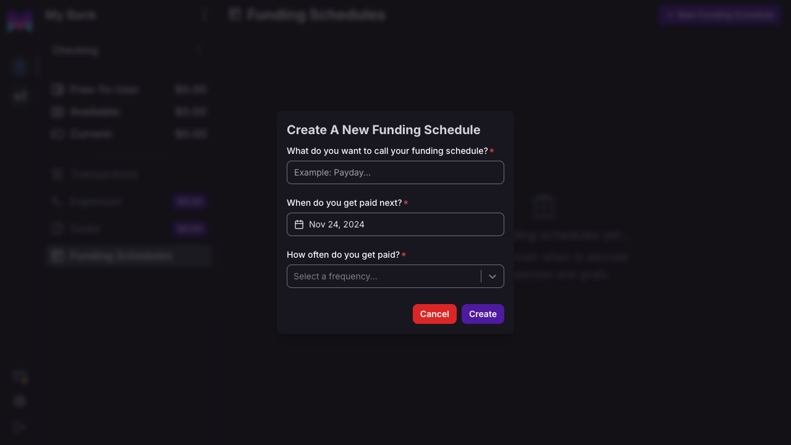
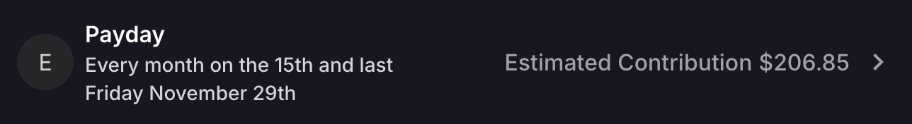
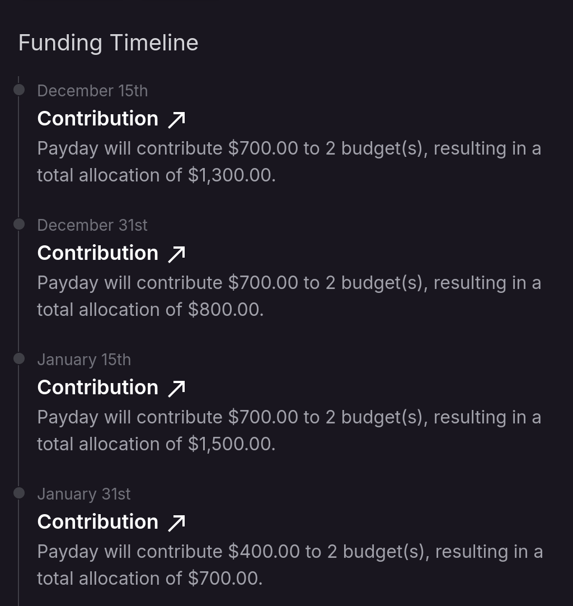

# Funding Schedules

## What Are Funding Schedules

Funding schedules let **monetr** know when to allocate funds for your budgets. Think of funding schedules as "when do
you get paid." Allocating funds each time you get paid ensures that your [Free-To-Use](./free_to_use) funds remain
predictable and consistent.

You can create multiple funding schedules if needed, such as putting money aside weekly or only once a month. Every
[Expense](./expense) or [Goal](./goal) you create must be tied to a funding schedule.

Funding schedules are unique to each bank account, not to the entire bank connection. For example, if you have both a
checking and savings account at the same bank, you may want separate funding schedules for each account. You can create
multiple funding schedules per account, but each must have a unique name within the account.

This flexibility allows, for instance, a primary funding schedule for your checking account, covering most of your
paycheck, and a secondary schedule for your savings account, allocating leftover funds.

## Create a Funding Schedule

To create a funding schedule, navigate to the funding view of your current account by clicking **Funding Schedules** in
the sidebar.

Then, click **New Funding Schedule** in the top navigation to open the creation modal.

### When Do You Get Paid Next?

This date acts as a baseline for the funding schedule's recurrence. It influences the options available in the [How
Often Do You Get Paid?](#how-often-do-you-get-paid) dropdown.

For example, if you’re paid every two weeks on Friday, select the next Friday you’ll be paid.

### How Often Do You Get Paid?

monetr supports the following recurring patterns:

- Weekly
- Every other week
- Monthly
- Every other month
- Every third month (quarterly)
- Every six months
- Yearly

If the date chosen in [When Do You Get Paid Next?](#when-do-you-get-paid-next) is the 1st, 15th, or last day of the
month, these additional options are available:

- 1st and 15th of every month
- 15th and last day of every month

## Additional Options

Funding schedules offer two optional features for a more tailored budgeting experience. These options are visible on the
funding schedule’s details page.

### Excluding Weekends

If you get paid on the 1st and 15th, or 15th and last day of the month, your paycheck may arrive earlier when the date
falls on a weekend. Deposits aren’t typically processed on weekends or holidays. To align your funding schedule with
when funds are likely deposited, enable **Exclude Weekends** in the details page.

When enabled, if the next scheduled funding date falls on a Saturday or Sunday, it will adjust to the previous weekday.

:::info
  Holidays are not yet accounted for, but this feature will be added in the future, particularly for
  bank holidays that impact deposits.
:::

### Estimated Deposit

Providing an estimated deposit amount helps monetr’s forecasting tools. This allows you to:

- Anticipate how much will be set aside from each paycheck.
- See an estimate of your [Free-To-Use](./free_to_use) funds after budgeting.

### Estimated Contribution

Once you’ve linked [Expenses](./expense) or [Goals](./goal) to a funding schedule, monetr calculates an "Estimated
Contribution" displayed on the funding schedule page. This value represents how much monetr expects to allocate toward
your budgets on the next funding date.

Ensure the estimated contribution is **less than** your expected deposit. If it exceeds your deposit, you may not have
enough funds to cover all expenses.

### Funding Timeline

As you create more [Expenses](./expense) and [Goals](./goal), the funding schedule provides insights into upcoming
funding events.

This timeline shows:

- How much money is expected to be allocated each time you’re paid.
- If you’ve specified an [Estimated Deposit](#estimated-deposit), it also shows the leftover amount after accommodating
your budgets.
